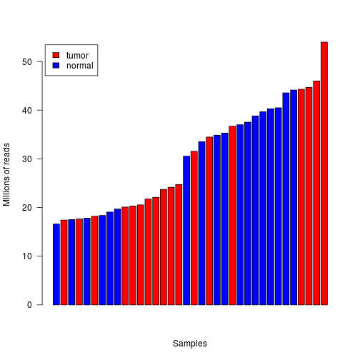
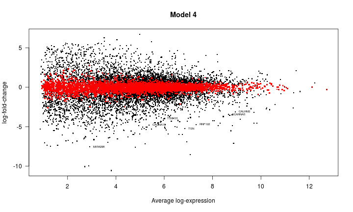

<!---
The following chunk of code, which should not be shown in the resulting document (echo=FALSE)
sets up global processing options, such as forcing 'knitr' to stop when an error
in the R code is encountered, caching of the results in the 'cache'
directory and asking 'knitr' to figure out automatically the dependencies among
code chunks to re-calculate cached results (autodep=TRUE).

Other options could be changing the name of the directory where figures end up
('figure' by default), etc. For a full account of 'knitr' options please consult
http://yihui.name/knitr/options

At the end of the chunk a 'cat()' call is made to dump a CSS file that gives
a better look-and-feel than the knitr default one. See the source css/ieo.css
and the resulting projectTemplate.html to understand where this is being dumpted.
--->

<style type="text/css">
/* Based on the bioconductor.css file from the BiocStyle package */

body, td {
   font-family: sans-serif;
   background-color: white;
   font-size: 13px;
}

body {
  max-width: 800px;
  margin: 0 auto;
  padding: 1em 1em 2em;
  line-height: 20px;
}

/* Table of contents style */

div#TOC li {
    list-style:none;
    background-image:none;
    background-repeat:none;
    background-position:0;
}

/* element spacing */

p, pre { 
  margin: 0em 0em 1em;
}

/* center images and tables */
img, table {
  margin: 0em auto 1em;
}

p {
  text-align: justify;
}

tt, code, pre {
   font-family: 'DejaVu Sans Mono', 'Droid Sans Mono', 'Lucida Console', Consolas, Monaco, monospace;
}

h2, h3, h4, h5, h6 { 
  font-family: Helvetica, Arial, sans-serif;
  margin: 1.2em 0em 0.6em 0em;
  font-weight: bold;
}

h1.title {
  font-size: 250%;
  font-weight: bold;
  color: #1a81c2;
  line-height: 1.4em;
  margin-top: 20px;
  border-bottom: 1px #1a81c2 solid;
}


h1 {
  font-size: 250%;
  font-weight: bold;
  line-height: 1.4em;
  margin-top: 20px;
  border-bottom: 1px #1a81c2 solid;
}

h2 {
  font-size: 160%;  
}

h1, h2, h3 {
  color: #1a81c2;
}


h3, h4, h5, h6 {
  font-size:115%;
} /* not expecting to dive deeper than four levels on a single page */

/* links are simply blue, hovering slightly less blue */
a { color: #1a81c2; text-decoration: none; }
a:active { outline: none; }
a:visited { color: #1a81c2; }
a:hover { color: #4c94c2; }

pre, img {
  max-width: 100%;
  display: block;
}

pre {
  border: 0px none;
  background-color: #F8F8F8;
  white-space: pre;
  overflow-x: auto;
}

pre code {
  border: 1px #aaa dashed;
  background-color: white;
  display: block;
  padding: 1em;  
  color: #111;
  overflow-x: inherit;
}

/* markdown v1 */
pre code[class] {
  background-color: inherit;
}

/* markdown v2 */
pre[class] code {
  background-color: inherit;
}

/* formatting of inline code */
code { 
  background-color: transparent;
  color: #87b13f;
  font-size: 92%;
}

/* formatting of tables */

table, td, th {
  border: none;
  padding: 0 0.5em;
}

/* alternating row colors */
tbody tr:nth-child(odd) td {
  background-color: #F8F8F8;
}

blockquote {
   color:#666666;
   margin:0;
   padding-left: 1em;
   border-left: 0.5em #EEE solid;
}

hr {
   height: 0px;
   border-bottom: none;
   border-top-width: thin;
   border-top-style: dotted;
   border-top-color: #999999;
}

span.header-section-number {
  padding-right: 1em;
}

span.toc-section-number::after {
    content: "  ";
    white-space: pre;
}

.caption {
  font-style: italic;
  text-align: center;
  margin-top: 2px;
  margin-bottom: 25px;
  font-size: 11pt;
}

@media print {
   * {
      background: transparent !important;
      color: black !important;
      filter:none !important;
      -ms-filter: none !important;
   }

   body {
      font-size:12pt;
      max-width:100%;
   }

   hr {
      visibility: hidden;
      page-break-before: always;
   }

   pre, blockquote {
      padding-right: 1em;
      page-break-inside: avoid;
   }

   tr, img {
      page-break-inside: avoid;
   }

   img {
      max-width: 100% !important;
   }

   @page :left {
      margin: 15mm 20mm 15mm 10mm;
   }

   @page :right {
      margin: 15mm 10mm 15mm 20mm;
   }

   p, h2, h3 {
      orphans: 3; widows: 3;
   }

   h2, h3 {
      page-break-after: avoid;
   }

   .caption {
     font-style: italic;
     text-align: center;
     margin-top: 2px;
     margin-bottom: 25px;
     font-size: 11pt;
   }

}
</style>

# Analysis of a The Cancer Genome Atlas (TCGA) RNA-seq data set on Uterine Corpus Endometrial Carcinoma (UCEC)

### Joaquim Aguirre (joaquim.aguirre01@estudiant.upf.edu), Gerard Funosas (gfunosas64@gmail.com), Cristina Prat (cristina.prat.ferrer@gmail.com)

## Introduction

Endometrial cancer develops in the cells that form the inner lining of the uterus, or the endometrium, and is one of the most common cancers of the female reproductive system. In 2010, approximately 43,000 women in the United States were estimated to have been diagnosed and almost 8,000 to have died of endometrial cancer. This cancer occurs most commonly in women aged 60 years or older. About 69 percent of endometrial cancers are diagnosed at an early stage, and as a result about 83 percent of women will survive five years following the time of diagnosis.

TCGA researchers have: 
- Identified four subtypes of endometrial cancer: POLE ultramutated, Microsatellite instability hypermutated, Copy number low and Copy number high
- Uncovered shared genomic features between endometrial cancer and serous ovarian cancer, the Basal-like subtype of breast cancer as well as colorectal cancer
- Characterized the marked differences between the two types of endometrial tumors (endometrioid and serous), and found that some endometrioid tumors have developed a strikingly similar pattern to serous tumors, suggesting they may benefit from a common treatment 
    - The serous and some of the endometrioid tumors are characterized by frequent mutations in TP53, extensive copy number alterations and few DNA methylation changes
    - The rest of the endometrioid tumors are characterized by few copy number alterations, scarce mutations in TP53 and frequent mutations in PTEN and KRAS


This document should be processed from R and you need to install the packages [knitr](http://cran.r-project.org/web/packages/knitr/index.html) and [markdown](http://cran.r-project.org/web/packages/markdown/index.html). Once they are installed, you have to type the following instructions that generate a HTML document that you can open with a web browser:

```
# Load libraries to process the document
library(knitr)     ## required for "knitting" from Rmd to md
library(markdown)  ## required for processing from md to HTML
knit2html("projectseUCEC.Rmd", force_v1=TRUE)  ## process Rmd to HTML
browseURL("projectseUCEC.html") ## open the resulting HTML file from R
```


## Data import

The project starts importing the raw table of counts. It contains RNA-seq counts for 20115 genes and 589 samples.


```r
library(SummarizedExperiment)

se <- readRDS(file.path("data", "seUCEC.rds"))
se
```

```
class: RangedSummarizedExperiment 
dim: 20115 589 
metadata(5): experimentData annotation cancerTypeCode
  cancerTypeDescription objectCreationDate
assays(1): counts
rownames(20115): 1 2 ... 102724473 103091865
rowData names(3): symbol txlen txgc
colnames(589): TCGA.2E.A9G8.01A.11R.A40A.07
  TCGA.4E.A92E.01A.11R.A37O.07 ... TCGA.FL.A1YV.11A.12R.A32Y.07
  TCGA.FL.A3WE.11A.11R.A22K.07
colData names(549): type bcr_patient_uuid ...
  lymph_nodes_aortic_pos_by_ihc lymph_nodes_aortic_pos_total
```

Using the following command it is possible to explore the phenotypic data information associated to the samples, which is associated in the R S4 object as metadata:


```r
dim(colData(se))
```

```
[1] 589 549
```

```r
colData(se)[1:5, 1:5]
```

```
DataFrame with 5 rows and 5 columns
                                 type                     bcr_patient_uuid
                             <factor>                             <factor>
TCGA.2E.A9G8.01A.11R.A40A.07    tumor 9583C10B-B21A-4863-98FA-61E735E64EA5
TCGA.4E.A92E.01A.11R.A37O.07    tumor                                   NA
TCGA.5B.A90C.01A.11R.A37O.07    tumor 16AC4341-CF8F-45E2-B90B-2D12D5F74A59
TCGA.5S.A9Q8.01A.11R.A40A.07    tumor 8751429B-4A11-451E-B978-DC9E9DB0EB36
TCGA.A5.A0G1.01A.11R.A118.07    tumor 53707bb3-426a-43cb-830f-3eeed930295f
                             bcr_patient_barcode form_completion_date
                                        <factor>             <factor>
TCGA.2E.A9G8.01A.11R.A40A.07        TCGA-2E-A9G8            2014-5-21
TCGA.4E.A92E.01A.11R.A37O.07                  NA                   NA
TCGA.5B.A90C.01A.11R.A37O.07        TCGA-5B-A90C            2014-4-17
TCGA.5S.A9Q8.01A.11R.A40A.07        TCGA-5S-A9Q8           2013-12-23
TCGA.A5.A0G1.01A.11R.A118.07        TCGA-A5-A0G1             2011-1-7
                             prospective_collection
                                           <factor>
TCGA.2E.A9G8.01A.11R.A40A.07                     NO
TCGA.4E.A92E.01A.11R.A37O.07                     NA
TCGA.5B.A90C.01A.11R.A37O.07                     NO
TCGA.5S.A9Q8.01A.11R.A40A.07                    YES
TCGA.A5.A0G1.01A.11R.A118.07                     NO
```

```r
mcols(colData(se), use.names=TRUE)
```

```
DataFrame with 549 rows and 2 columns
                                                         labelDescription
                                                              <character>
type                                           sample type (tumor/normal)
bcr_patient_uuid                                         bcr patient uuid
bcr_patient_barcode                                   bcr patient barcode
form_completion_date                                 form completion date
prospective_collection            tissue prospective collection indicator
...                                                                   ...
lymph_nodes_pelvic_pos_total                               total pelv lnp
lymph_nodes_aortic_examined_count                           total aor lnr
lymph_nodes_aortic_pos_by_he                          aln pos light micro
lymph_nodes_aortic_pos_by_ihc                                 aln pos ihc
lymph_nodes_aortic_pos_total                                total aor-lnp
                                        CDEID
                                  <character>
type                                       NA
bcr_patient_uuid                           NA
bcr_patient_barcode                   2673794
form_completion_date                       NA
prospective_collection                3088492
...                                       ...
lymph_nodes_pelvic_pos_total          3151828
lymph_nodes_aortic_examined_count     3104460
lymph_nodes_aortic_pos_by_he          3151832
lymph_nodes_aortic_pos_by_ihc         3151831
lymph_nodes_aortic_pos_total          3151827
```

These metadata provides with useful information about the clinical variables of the samples. The 'CDEID' column corresponds to the so-called `Common Data Element (CDE)` identifier, which can be used in https://cdebrowser.nci.nih.gov to search for further information about the associated clinical variable using the `Advanced search` form and the `Public ID` attribute search.

Associated to the row (feature) data, there are 455 sequences (1 circular) from hg38 genome:


```r
rowRanges(se)
```

```
GRanges object with 20115 ranges and 3 metadata columns:
            seqnames               ranges strand |      symbol     txlen
               <Rle>            <IRanges>  <Rle> | <character> <integer>
          1    chr19 [58345178, 58362751]      - |        A1BG      3322
          2    chr12 [ 9067664,  9116229]      - |         A2M      4844
          9     chr8 [18170477, 18223689]      + |        NAT1      2280
         10     chr8 [18391245, 18401218]      + |        NAT2      1322
         12    chr14 [94592058, 94624646]      + |    SERPINA3      3067
        ...      ...                  ...    ... .         ...       ...
  100996331    chr15 [20835372, 21877298]      - |       POTEB      1706
  101340251    chr17 [40027542, 40027645]      - |    SNORD124       104
  101340252     chr9 [33934296, 33934376]      - |   SNORD121B        81
  102724473     chrX [49303669, 49319844]      + |      GAGE10       538
  103091865    chr21 [39313935, 39314962]      + |   BRWD1-IT2      1028
                 txgc
            <numeric>
          1 0.5644190
          2 0.4882329
          9 0.3942982
         10 0.3895613
         12 0.5249429
        ...       ...
  100996331 0.4308324
  101340251 0.4903846
  101340252 0.4074074
  102724473 0.5055762
  103091865 0.5924125
  -------
  seqinfo: 455 sequences (1 circular) from hg38 genome
```

From the S4 object, it is possible to extract information about the gender of the patients who donated the samples. As the study is focused on endometrial cancer, all the samples are from female patients. There are also 33 'NA' samples which were considered to be discarded, but finally they have been mantained as they provide the project with some normal samples, which are not abundant in the dataset.


```r
table(se$gender)
```

```

FEMALE 
   556 
```


## Quality assessment and normalization

The fact that each RNA-seq sample may have been ultimately sequenced at slightly different depth and that there may be sample-specific biase implies that it may be needed to consider two normalization steps:

-  Within-sample: adjustments to compare across features in a sample. 
    - Scaling: using counts per million reads (CPM mapped to the genome) 
-  Between-sample: adjustments to compare a feature across samples.
    - Sample-specific normalization factors: using the TMM algorithm (package edgeR)
    - Quantile normalization: using the CQN algorithm (package cqn)

To perform quality assessment and normalization it is necessary to load the [edgeR](http://bioconductor.org/packages/edgeR) R/Bioconductor package and create a `DGEList' object. We adjust for sample- and gene-specific factors, to make gene expression values comparable across samples. 


```r
library(edgeR)

dge <- DGEList(counts=assays(se)$counts, genes=mcols(se))
```

```
Warning in as.data.frame(x, row.names = NULL, optional = optional, ...):
Arguments in '...' ignored
```

```r
names(dge)
```

```
[1] "counts"  "samples" "genes"  
```


### CPM scaling

Now that the 'DGEList' object has been created, it is possible to perform the scaling to CPM values. Therefore, $\log_2$ CPM values of expression are calculated and used as an additional assay element to ease their manipulation. $\log_2$ CPM units separate better high and low expression, than raw counts or non-logged CPM units.


```r
assays(se)$logCPM <- cpm(dge, log=TRUE, prior.count=0.5)
assays(se)$logCPM[1:5, 1:5]
```

```
   TCGA.2E.A9G8.01A.11R.A40A.07 TCGA.4E.A92E.01A.11R.A37O.07
1                     0.4787484                   0.08427463
2                     8.6045526                   9.69917999
9                    -5.6232476                  -5.62324755
10                   -5.6232476                  -5.62324755
12                    5.2785238                   5.65345688
   TCGA.5B.A90C.01A.11R.A37O.07 TCGA.5S.A9Q8.01A.11R.A40A.07
1                     -1.299515                     1.486274
2                      7.998470                     8.158385
9                     -5.623248                    -5.623248
10                    -5.623248                    -5.623248
12                     4.835107                     5.988568
   TCGA.A5.A0G1.01A.11R.A118.07
1                      2.005532
2                      8.518400
9                     -5.623248
10                    -5.623248
12                     5.593132
```


### Library sizes

It is primordial to examine the library sizes in terms of total number of sequence read counts per sample. Figure S1.1 below shows library sizes per sample in increasing order:

<!---
you can control the height and width in pixels of the figure with 'out.height' and 'out.width'
--->

<p class="caption">Figure S1.1: Library sizes in increasing order.</p>

As there is a large amount of samples, it is difficult to distinguish between tumor and normal samples in this plot. In further steps, it may be necessary to work with a subset in order to obtain clearer results.
However, the figure S1.1 reveals substantial differences in sequencing depth between samples and it may be considered discarding those samples whose depth is substantially lower than the rest. 


```r
sampledepth <- round(dge$sample$lib.size / 1e6, digits=1)
sampledepth <- sort(sampledepth)
sampledepth[1:50]
```

```
 [1]  3.3  5.4  6.1  6.1  6.1  6.2  6.8  7.0  7.1  7.7  8.2  8.7  8.8  9.0
[15]  9.0  9.8 10.0 10.0 10.1 10.2 10.3 10.3 10.4 10.7 10.9 10.9 10.9 11.0
[29] 11.3 11.3 11.5 11.5 11.8 11.8 12.3 12.5 12.7 12.8 12.8 12.9 12.9 13.4
[43] 13.4 13.7 13.8 13.9 14.0 14.0 14.2 14.2
```

It has been considered to discard those samples corresponding to the 10% quartile of the sample depth distribution, as the quality of the sequentiation of these samples is poorer.


```r
mask <- round(dge$sample$lib.size / 1e6, digits=1) > quantile(sampledepth, .1)
dge <- dge[ , mask]
dim(dge)
```

```
[1] 20115   527
```

```r
se <- se[ , mask]
dim(se)
```

```
[1] 20115   527
```

```r
sampledepth <- round(dge$sample$lib.size / 1e6, digits=1)
sampledepth <- sort(sampledepth)
sampledepth[1:50]
```

```
 [1] 14.7 14.7 14.8 14.8 14.8 14.8 14.9 14.9 14.9 14.9 15.0 15.0 15.0 15.0
[15] 15.0 15.0 15.0 15.1 15.1 15.2 15.2 15.2 15.2 15.2 15.2 15.4 15.4 15.5
[29] 15.5 15.5 15.6 15.6 15.6 15.6 15.6 15.6 15.7 15.8 15.8 15.8 15.9 16.0
[43] 16.0 16.1 16.1 16.1 16.1 16.2 16.2 16.3
```

The filtered set has now 527 samples. Before, there was a range of sample depth from 3.3 to 60.1 millions of reads, and now the range starts at 14.7 million reads. 


### Subsetting

As it has been stated previously, a subsetting step is necessary in order to manage easily the set of samples and obtain clearer results. But it is important to work with a subset which is as much representative as the initial set of samples and that contains the samples with higher quality. Three types of subsetting have been considered:
- Random subsetting: As there is a small number of normal samples, this subsetting takes all normal samples, and  then the same number of tumor samples randomly
- Paired subsetting: It uses only normal and tumor samples which are paired together, so that they are from the same patient
- Independent subsetting: It uses only normal and tumor samples which are independent, so that they are not from the same patient

The three options have been considered and tested. The paired subsetting offers the advantage that as samples are paired, the posterior analysis of batch effect identification will be performed with a perfectly balanced set, which avoids confusions for not having samples of one of the variables. However, in this dataset there are only 36 paired samples, which is a very small subset of samples.

The other two options permit to work with a higher number of samples, but there are many problems related with having an unbalanced set.

Finally, it has been preferred to work with the paired subset of samples in order to perform a clearer analysis of possible batch effects. The code used to perform random or indepedent subsetting has been left for possible future use.

#### Random subsetting


```r
#mask <- se$type == "normal"
#tumor <- se[, !mask]
#subtumor <- tumor[, sample(1:ncol(tumor), length(mask[ which(mask==TRUE)]))]
#se <- cbind(subtumor, se[, mask])
#se
#dge <- DGEList(counts=assays(se)$counts, genes=mcols(se))
```

#### Independent subsetting


```r
# mask <- se$type == "normal"
# tumor <- se[, !mask]
# normal <- se[, mask]
# participant <- substr(colnames(se), 9, 12)
# paired <- names(which(table(participant) == 2))
# length(paired)

# mask <- substr(colnames(se), 9, 12) %in% paired
# paired_samples <- se[, mask]
# mask <- substr(colnames(paired_samples), 9, 12) %in% substr(colnames(normal), 9, 12)
# paired_samples <- paired_samples[, mask]
# tumor_paired <- paired_samples[ , paired_samples$type == "tumor"]
# normal_paired <- paired_samples[ , paired_samples$type =="normal"]
# mask <- colnames(se) %in% colnames(tumor_paired)
# independent <- se[ , !mask]

# se <- independent
# dge <- DGEList(counts=assays(independent)$counts, genes=mcols(independent))
```

#### Paired subsetting


```r
mask <- se$type == "normal"
tumor <- se[, !mask]
normal <- se[, mask]
participant <- substr(colnames(se), 9, 12)
paired <- names(which(table(participant) == 2))
mask <- substr(colnames(se), 9, 12) %in% paired
paired_samples <- se[, mask]
mask <- substr(colnames(paired_samples), 9, 12) %in% substr(colnames(normal), 9, 12)
paired_samples <- paired_samples[, mask]
dim(paired_samples)
```

```
[1] 20115    36
```

```r
colnames(paired_samples)
```

```
 [1] "TCGA.AJ.A3NC.01A.11R.A22K.07" "TCGA.AJ.A3NE.01A.11R.A22K.07"
 [3] "TCGA.AJ.A3NH.01A.11R.A22K.07" "TCGA.AX.A05Y.01A.11R.A00V.07"
 [5] "TCGA.AX.A0IZ.01A.11R.A118.07" "TCGA.AX.A0J0.01A.11R.A109.07"
 [7] "TCGA.AX.A1CF.01A.11R.A137.07" "TCGA.AX.A2H8.01A.11R.A17B.07"
 [9] "TCGA.AX.A2HC.01A.11R.A17B.07" "TCGA.AX.A2HD.01A.21R.A17B.07"
[11] "TCGA.BG.A2AD.01A.21R.A16F.07" "TCGA.BG.A3EW.01A.11R.A22K.07"
[13] "TCGA.BG.A3PP.01A.11R.A22K.07" "TCGA.BK.A0CB.01A.32R.A104.07"
[15] "TCGA.BK.A13C.01A.11R.A118.07" "TCGA.BK.A4ZD.01A.11R.A27V.07"
[17] "TCGA.DI.A2QY.01A.12R.A19W.07" "TCGA.E6.A1M0.01A.11R.A144.07"
[19] "TCGA.AJ.A3NC.11A.11R.A22K.07" "TCGA.AJ.A3NE.11A.11R.A22K.07"
[21] "TCGA.AJ.A3NH.11A.11R.A22K.07" "TCGA.AX.A05Y.11A.11R.A27V.07"
[23] "TCGA.AX.A0IZ.11A.11R.A27V.07" "TCGA.AX.A0J0.11A.11R.A27V.07"
[25] "TCGA.AX.A1CF.11A.11R.A137.07" "TCGA.AX.A2H8.11A.11R.A17B.07"
[27] "TCGA.AX.A2HC.11A.11R.A32Y.07" "TCGA.AX.A2HD.11A.11R.A32Y.07"
[29] "TCGA.BG.A2AD.11A.11R.A16F.07" "TCGA.BG.A3EW.11A.22R.A22K.07"
[31] "TCGA.BG.A3PP.11A.11R.A22K.07" "TCGA.BK.A0CB.11A.33R.A104.07"
[33] "TCGA.BK.A13C.11A.11R.A118.07" "TCGA.BK.A4ZD.11A.12R.A27V.07"
[35] "TCGA.DI.A2QY.11A.11R.A19W.07" "TCGA.E6.A1M0.11A.11R.A144.07"
```

```r
table(paired_samples$type)
```

```

normal  tumor 
    18     18 
```

```r
se <- paired_samples
dge <- DGEList(counts=assays(paired_samples)$counts, genes=mcols(paired_samples))
```

```
Warning in as.data.frame(x, row.names = NULL, optional = optional, ...):
Arguments in '...' ignored
```


The plot showing the filtered library sizes after the random subsetting is represented in figure S1.2:

<p class="caption">Figure S1.2: Filtered library sizes in increasing order.</p>


### Distribution of expression levels among samples

The following plot shows the distribution of expression values per sample in terms of logarithmic CPM units. Due to the large number of samples, tumor and normal samples are displayed separately.

<!---
the option echo=FALSE hides the R code. When plotting in general one does not
want to see the code. Options fig.height and fig.width control height and width
of the plot in inches while out.height and out.width do it in the final output
file; see http://yihui.name/knitr/options for full details.
--->

<p class="caption">Figure S2: Non-parametric density distribution of expression profiles per sample.</p>

There are no substantial differences appreciated between the samples in the distribution of expression values.


### Distribution of expression levels among genes

The average expression per gene through all the samples is calculated. $\log_2$ CPM values per gene are examined. Figure S3 shows the distribution of those values across genes.

<p class="caption">Figure S3: Distribution of average expression level per gene.</p>


### Filtering of lowly-expressed genes

In the light of the plot in figure S3, it may be considers a cutoff of 1 log CPM unit (as represented by the red line) as minimum value of expression to select genes being expressed across samples. Using this cutoff we proceed to filter out lowly-expressed genes.


```r
mask <- avgexp > 1
se <- se[mask, ]
dim(se)
```

```
[1] 11571    36
```

```r
dge <- dge[mask, ]
dim(dge)
```

```
[1] 11571    36
```

### Normalization

The normalization factors are calculated on the filtered expression data set. They have been calculated using the Trimmed Mean of M-values (TMM) method which addresses the issue of the different RNA composition of the samples by estimating a scaling factor for each library.


```r
dge <- calcNormFactors(dge)
```

The raw log2 CPM units have been replaced in the corresponding assay element of the `SummarizedExperiment` object, by the normalized ones.


```r
assays(se)$logCPM <- cpm(dge, log=TRUE, prior.count=0.5)
```


### MA-plots

The MA-plots of the normalized expression profiles are performed. First, the plots corresponding to tumor samples are built:

<!---
Here we make a MA-plot for each sample. The options 'fig.height' and 'fig.width'
control the relative image size in *inches*. The final image size results from
'height'x'dpi' and 'width'x'dpi', where 'dpi' is the image resolution in
"dots per inch" (by default dpi=72). To scale the image to a desired size use
'out.width' and 'out.height'. More information at http://yihui.name/knitr/options
--->

<p class="caption">Figure S4: MA-plots of the tumor samples.</p>

In general, we do not observe samples with major expression-level dependent biases, although some of them show variations in low-expressed values.
Now, the plots of the normal samples are performed:

<p class="caption">Figure S5: MA-plots of the normal samples.</p>

In this case, most of the normals have correct MA plots, but for some of them we see slightly expression-level dependent biases. The most suspicious cases are TCGA-AJ-A3NH, TCGA-AX-A2HC, TCGA-BK-A13C and TCGA-DI-A2QY, showing sizable dependency between M and A values. 
We should consider discarding those samples from the dataset if they present further signs of problematic features.  


### Batch identification

This step will be focused on finding potential surrogate of batch effect indicators. Given that each sample names corresponds to a TCGA barcode (see https://wiki.nci.nih.gov/display/TCGA/TCGA+barcode), following the strategy described in http://bioinformatics.mdanderson.org/main/TCGABatchEffects:Overview we are going to derive different elements of the TCGA barcode and examine their distribution across samples.

From this information we can make the following observations:

  * Samples were collected across different tissue source sites (TSS):
  

```r
tss <- substr(colnames(se), 6, 7)
table(tss)
```

```
tss
AJ AX BG BK DI E6 
 6 14  6  6  2  2 
```

  * All tumor samples belong to the same type (Code: 01, primary solid Tumor), while all normal samples belong to the "solid tissue normal" type (Code: 11):


```r
samplevial <- substr(colnames(se), 14, 16)
table(samplevial)
```

```
samplevial
01A 11A 
 18  18 
```

  * The majority of the samples were sequenced using the same analyte:


```r
portionanalyte <- substr(colnames(se), 18, 20)
table(portionanalyte)
```

```
portionanalyte
11R 12R 21R 22R 32R 33R 
 29   2   2   1   1   1 
```
  
  * Samples were sequenced within different plates:
  

```r
plate <- substr(colnames(se), 22, 25)
table(plate)
```

```
plate
A00V A104 A109 A118 A137 A144 A16F A17B A19W A22K A27V A32Y 
   1    2    1    3    2    2    2    4    2   10    5    2 
```

  * All samples were sequenced at the same center 07:
  

```r
center <- substr(colnames(se), 27, 28)
table(center)
```

```
center
07 
36 
```

We are going to use the TSS as surrogate of batch effect indicator. Considering our outcome of interest as molecular changes between sample types, tumor vs. normal, we will examine now the cross-classification of this outcome with TSS.


```r
table(data.frame(TYPE=se$type, TSS=tss))
```

```
        TSS
TYPE     AJ AX BG BK DI E6
  normal  3  7  3  3  1  1
  tumor   3  7  3  3  1  1
```

The experimental design using paired samples has the advantage which is perfectly balanced, as individuals from every outcome occur the same number of times through every batch.

We examine now how samples group together by hierarchical clustering and multidimensional scaling, annotating the outcome of interest and the the surrogate of batch indicator. 

We calculate again log CPM values with a higher prior count to moderate extreme fold-changes produced by low counts. 


```r
logCPM <- cpm(dge, log=TRUE, prior.count=3)
```

Next, calculate the distance between every pair of samples using a non-parametric association measure such as Spearman correlation:


```r
d <- as.dist(1-cor(logCPM, method="spearman"))
```

Then, perform a hierarchical clustering of the samples:


```r
sampleClustering <- hclust(d)
```

Now define the batch indicator variable as factor(tss), and extract the corresponding dendrogram annotating batch and outcome on its leafs. The resulting dendrogram is shown in Figure S6.


```r
par(mfrow=c(1, 1))
batch <- as.integer(factor(tss))
sampleDendrogram <- as.dendrogram(sampleClustering, hang=0.1)
names(batch) <- colnames(se)
outcome <- paste(substr(colnames(se), 9, 12), as.character(se$type), sep="-")
names(outcome) <- colnames(se)
sampleDendrogram <- dendrapply(sampleDendrogram,
                               function(x, batch, labels) {
                                 if (is.leaf(x)) {
                                   attr(x, "nodePar") <- list(lab.col=as.vector(batch[attr(x, "label")]))
                                   attr(x, "label") <- as.vector(labels[attr(x, "label")])
                                 }
                                 x
                               }, batch, outcome)
plot(sampleDendrogram, main="Hierarchical clustering of samples")
legend("topright", paste("Batch", sort(unique(batch)), levels(factor(tss))), fill=sort(unique(batch)))
```

<p class="caption">Figure S6: Hierarchical clustering of the samples.</p>

In Figure S6, it can be observed that samples cluster primarily by sample type, tumor or normal. In general, there is a heterogeneous distribution of the different batches among the plot, and therefore there is no batch effect observed.


```r
plotMDS(dge, labels=outcome, col=batch)
legend("bottomright", paste("Batch", sort(unique(batch)), levels(factor(tss))),
       fill=sort(unique(batch)))
```

<p class="caption">Figure S7: Multidimensional scaling plot of the samples.</p>

In Figure S7 we show the corresponding multidimensional plot (MDS). Here it can be seen more clearly that the first source of variation separates tumor from normal samples.
It can be observed that one tumor sample, corresponding to individual `A2HC-tumor` is separated from the rest, just as it happens in the hierchical clustering. A closer examination of its corresponding MA-plot also reveals a slight dependence of expression changes on average expression, overall in its paired normal sample. This turns to be one of the problematic samples we found previously, so at that point that pair of samples should be discarded to avoid undesired variation. 
Another similar case is the sample A2QY-normal, very clustered away within the normal group in the MDS plot, and also stated before as a problematic sample in the MA plot. For this reason, the A2QY samples will be removed.


```r
mask <- -grep("TCGA.AX.A2HC", colnames(se))
se <- se[,mask]
dge <- dge[,mask]
mask <- -grep("TCGA.DI.A2QY", colnames(se))
se <- se[,mask]
dge <- dge[,mask]
```

With 4 paired samples removed, we need to recalculate the variables:


```r
tss <- substr(colnames(se), 6, 7)
logCPM <- cpm(dge, log=TRUE, prior.count=3)
```


```r
par(mfrow=c(1, 1))
batch <- as.integer(factor(tss))
sampleDendrogram <- as.dendrogram(sampleClustering, hang=0.1)
names(batch) <- colnames(se)
outcome <- paste(substr(colnames(se), 9, 12), as.character(se$type), sep="-")
names(outcome) <- colnames(se)
sampleDendrogram <- dendrapply(sampleDendrogram,
                               function(x, batch, labels) {
                                 if (is.leaf(x)) {
                                   attr(x, "nodePar") <- list(lab.col=as.vector(batch[attr(x, "label")]))
                                   attr(x, "label") <- as.vector(labels[attr(x, "label")])
                                 }
                                 x
                               }, batch, outcome)
plot(sampleDendrogram, main="Hierarchical clustering of samples")
legend("topright", paste("Batch", sort(unique(batch)), levels(factor(tss))), fill=sort(unique(batch)))
```

<p class="caption">Figure S6: Hierarchical clustering of the samples.</p>

And get the new MDS plot: 


```r
plotMDS(dge, labels=outcome, col=batch)
legend("bottomright", paste("Batch", sort(unique(batch)), levels(factor(tss))),
       fill=sort(unique(batch)))
```

<p class="caption">Figure S7_3: Multidimensional scaling plot of the samples.</p>

### Removing batch effect: ComBat

One of these techniques to remove batch effect is ComBat (http://www.ncbi.nlm.nih.gov/pubmed/16632515), which is an empirical Bayes method robust to outliers in small sample sizes.
The sva (http://www.bioconductor.org/packages/release/bioc/html/sva.html) package provides a function called ComBat() to use this technique as follows:


```r
library(sva)
mod <- model.matrix(~ se$type, colData(se))
combatexp <- ComBat(logCPM, batch, mod)
```

```
Found 5 batches
Adjusting for 1 covariate(s) or covariate level(s)
Standardizing Data across genes
Fitting L/S model and finding priors
Finding parametric adjustments
Adjusting the Data
```

```r
d <- as.dist(1-cor(combatexp, method="spearman"))

sampleClustering <- hclust(d)
```

Let's verify the extent to which batch effect has been removed with the hierarchical clustering of the samples:


```r
par(mfrow=c(1, 1))
batch <- as.integer(factor(tss))
sampleDendrogram <- as.dendrogram(sampleClustering, hang=0.1)
names(batch) <- colnames(se)
outcome <- paste(substr(colnames(se), 9, 12), as.character(se$type), sep="-")
names(outcome) <- colnames(se)
sampleDendrogram <- dendrapply(sampleDendrogram,
                               function(x, batch, labels) {
                                 if (is.leaf(x)) {
                                   attr(x, "nodePar") <- list(lab.col=as.vector(batch[attr(x, "label")]))
                                   attr(x, "label") <- as.vector(labels[attr(x, "label")])
                                 }
                                 x
                               }, batch, outcome)
plot(sampleDendrogram, main="Hierarchical clustering of samples")
legend("topright", paste("Batch", sort(unique(batch)), levels(factor(tss))), fill=sort(unique(batch)))
```

<p class="caption">Figure S8: Hierarchical clustering of the samples.</p>

The plot in Figure S8 shows a better stratification of the tumor and normal samples than in the last plot (Figure S6) without removing the batch effect. 


## Differential expression: Simple analysis

We perform a simple examination of expression changes and their associated p-values using the R/Bioconductor package [sva](http://bioconductor.org/packages/sva).

Surrogate variable analysis (SVA) is a technique that tries to capture sources of heterogenity in high-throughput profiling data, such as non-biological variability introduced by batch effects.
The output of SVA is an estimation of the number of so-called "surrogate variables" and their continuous values, which can be used later on to adjust for these unmeasured and unwanted effects.


```r
library(sva)
mod <- model.matrix(~ se$type, colData(se))
mod0 <- model.matrix(~ 1, colData(se))
pv <- f.pvalue(assays(se)$logCPM, mod, mod0)
sum(p.adjust(pv, method="fdr") < 0.01)
```

```
[1] 5093
```

There are 5093 genes changing significantly their expression at FDR < 1%. In Figure S9 below we show the distribution of the resulting p-values.

<p class="caption">Figure S9: Distribution of raw p-values for an F-test on every gene between tumor and normal samples.</p>

Now, let's estimate surrogate variables using the `sva()` function.


```r
sv <- sva(assays(se)$logCPM, mod, mod0)
```

```
Number of significant surrogate variables is:  11 
Iteration (out of 5 ):1  2  3  4  5  
```

```r
sv$n
```

```
[1] 11
```

The SVA algorithm has found 11 surrogate variables. Let's use them to assess again the extent of differential expression this time adjusting for these surrogate variables.


```r
modsv <- cbind(mod, sv$sv)
mod0sv <- cbind(mod0, sv$sv)
pvsv <- f.pvalue(assays(se)$logCPM, modsv, mod0sv)
sum(p.adjust(pvsv, method="fdr") < 0.01)
```

```
[1] 6966
```

We have increased the number of changing genes to 6966.
Figure S10 shows the resulting distribution of p-values.

<p class="caption">Figure S10: Distribution of raw p-values for an F-test on every gene between tumor and normal samples, adjusting for surrogate variables estimated with SVA.</p>


## Differential expression: Extended analysis

A linear regression model is a statistical model that captures linear relationships between a response variable and its predictor variables.

The conceptual purpose of a linear regression model is to represent, as accurately as possible, something complex, the data denoted by `y`, which is n-dimensional, in terms of something much simpler, the `model`, which is p -dimensional.
Thus, if our model is successful, the structure in the data should be captured in those
`p` dimensions, leaving just random variation in the residuals which lie in an `(n-p)-dimensional space`.

In the context of DE analysis, linear regression models can be written in matrix form, in `design matrices`. The design matrix contains as many rows as samples and as many columns as coefficients to be estimated. 

A typical workflow to calculate DE analysis with [limma](http://www.bioconductor.org/packages/release/bioc/html/limma.html)
consists of the following steps:

1. Build design matrix: `model.matrix()`

2. Calculate observational-level weights (not necessary for microarray data): `voom()`

3. Estimate correlation in repeated measurements of a blocking factor (if needed): `duplicateCorrelation()`

4. Fit linear model: `lmFit()`

5. Build contrast matrix (if needed): `makeContrasts()`

6. Fit contrasts (if needed): `contrasts.fit()`

7. Calculate moderated $t$-statistics: `eBayes()`

8. Output results: `topTable()`

Now, we are going to observe the result of different approaches to perform DE analysis.

### 1. Fit directly the linear model to every gene (fdr microarray data?)

We create the desing matrix using the function `model.matrix()` as follows:


```r
design <- model.matrix(~factor(type), data = colData(se))
head(design)
```

```
                             (Intercept) factor(type)tumor
TCGA.AJ.A3NC.01A.11R.A22K.07           1                 1
TCGA.AJ.A3NE.01A.11R.A22K.07           1                 1
TCGA.AJ.A3NH.01A.11R.A22K.07           1                 1
TCGA.AX.A05Y.01A.11R.A00V.07           1                 1
TCGA.AX.A0IZ.01A.11R.A118.07           1                 1
TCGA.AX.A0J0.01A.11R.A109.07           1                 1
```

We are going to work as if the logCPM values were microarray expression data and fit directly the linear model specified in the design matrix to every gene using `lmFit()`:


```r
fit <- lmFit(assays(se)$logCPM, design)
```

Ww calculate moderated $t$-statistics using `eBayes`:


```r
# Calculate moderated t-statistics --> p-value. 
fit <- eBayes(fit)
```

A quick overview of the results can be obtained with `decideTests()`:


```r
# Matrix of boolean: DE or not (criteria: p-value < 0.05)
FDRcutoff <- 0.05
res <- decideTests(fit, p.value = FDRcutoff)
summary(res) 
```

```
   (Intercept) factor(type)tumor
-1          30              3249
0          260              5114
1        11281              3208
```

```r
# 3246 genes are underexpressed in tumor and overexpressed in normal. 
#Take into account the category in the numerator!
```

To obtain a full table of all results we should use the function `topTable()` as follows:


```r
# Table of DE genes
tt <- topTable(fit, coef = 2, n = Inf) # coef = 2 is for the second column. The colname can also be used. 
                                      # n = Inf is for obtaining all DE genes. By default we would only see 10. 
class(tt)
```

```
[1] "data.frame"
```

```r
dim(tt)
```

```
[1] 11571     6
```

```r
head(tt)
```

```
               logFC  AveExpr         t      P.Value    adj.P.Val        B
100423021  -7.770322 2.915817 -19.83072 8.213668e-20 9.118237e-16 34.98370
136647    -10.924134 3.807787 -19.40805 1.576050e-19 9.118237e-16 34.36003
125       -10.196670 2.839204 -16.34769 2.601714e-17 7.773403e-14 29.42196
10844       2.407317 3.986429  16.32964 2.687202e-17 7.773403e-14 29.39044
81626       2.287176 7.656542  15.95795 5.262783e-17 1.073157e-13 28.73444
144348      5.587508 3.240038  15.82544 6.707689e-17 1.073157e-13 28.49739
```

```r
FDRcutoff <- 0.05
table(tt$adj.P.Val < FDRcutoff) # 6407 genes are differentially expressed
```

```

FALSE  TRUE 
 5114  6457 
```

```r
# B is a logODDS. Probability of being DE / probability of not being DE
# LogFC is the coefficient
# rownames of the table correspond to feature identifiers, Entrez Gene IDs in this case. We can add further gene metadata if we want
genesmd <- data.frame(chr = as.character(seqnames(rowRanges(se))), symbol = rowData(se)[,1], stringsAsFactors = FALSE)
fit$genes <- genesmd
tt <- topTable(fit, coef = 2, n = Inf)
head(tt)
```

```
            chr  symbol      logFC  AveExpr         t      P.Value
100423021 chr11 MIR4298  -7.770322 2.915817 -19.83072 8.213668e-20
136647     chr7  MPLKIP -10.924134 3.807787 -19.40805 1.576050e-19
125        chr4   ADH1B -10.196670 2.839204 -16.34769 2.601714e-17
10844     chr10 TUBGCP2   2.407317 3.986429  16.32964 2.687202e-17
81626      chr1 SHCBP1L   2.287176 7.656542  15.95795 5.262783e-17
144348    chr12  ZNF664   5.587508 3.240038  15.82544 6.707689e-17
             adj.P.Val        B
100423021 9.118237e-16 34.98370
136647    9.118237e-16 34.36003
125       7.773403e-14 29.42196
10844     7.773403e-14 29.39044
81626     1.073157e-13 28.73444
144348    1.073157e-13 28.49739
```

```r
# Examine the chormosome distribution of genes called DE at 5% of FDR
sort(table(tt$chr[tt$adj.P.Val < FDRcutoff]), decreasing = TRUE)
```

```

                chr1                chr19                chr11 
                 669                  462                  447 
                chr2                chr17                 chr3 
                 439                  368                  364 
               chr12                 chr7                 chr6 
                 339                  314                  285 
                chr5                chr16                 chr9 
                 279                  263                  261 
                chrX                chr14                chr10 
                 243                  238                  230 
                chr4                 chr8                chr20 
                 214                  206                  204 
               chr15                chr22                chr13 
                 198                  139                  117 
               chr21                chr18                 chrY 
                  84                   82                    9 
chr17_GL000258v2_alt chr19_KI270921v1_alt  chr1_KI270766v1_alt 
                   1                    1                    1 
```

```r
# Fetch gene identifiers of DE genes with FDR < 5%
DEgenes <- rownames(tt)[tt$adj.P.Val < FDRcutoff]
DEgenes_symbol <- tt$symbol[tt$adj.P.Val < FDRcutoff]
length(DEgenes)
```

```
[1] 6457
```

Using this simple analysis, the results obtained are 6457 DE genes. As it can be seen in the chromosome distribution, the chromosome with more DE genes is chr1.


Assess accuracy in terms of recall and precision:


```r
# Calculate the recall as the fraction of genes with documented type-specific expression that we have called DE
# Calculate the precision as the fraction of DE genes with documented type-specific expression
```

Two useful diagnostic plots for DE analysis are the distributions of p-values and moderated t-statistics:


```r
par(mfrow = c(1, 2), mar = c(4, 5, 2, 2))
hist(tt$adj.P.Val, xlab = "Raw P-values", main = "", las = 1)
qqt(fit$t[, 2], df = fit$df.prior + fit$df.residual, main = "", pch = ".", cex = 3)
abline(0, 1, lwd = 2)
```


### 2. Fit adjusting for the mean-variance relationship

RNA-seq counts may vary considerably from sample to sample for the same gene and different samples may be sequenced to different depths. This may lead to identical CPM values for very different count sizes and motivates the need to model the mean-variance trend of log-CPM values at the individual observation level.

What we will do is to calculate weights that estimate the mean-variance relationship at individual observation-by-gene level.


```r
v <- voom(dge, design, plot=TRUE)
```


Now, we will fit again the linear model this time using the voom weights:


```r
fit2 <- lmFit(v, design)
```

Calculate again moderated t-statistics:


```r
fit2 <- eBayes(fit2)
```

Examine the extent of differential expression at 5% FDR:


```r
res2 <- decideTests(fit2, p.value = FDRcutoff)
summary(res2)
```

```
   (Intercept) factor(type)tumor
-1          21              3289
0          294              5130
1        11256              3152
```

Add gene metadata and fetch table of results:


```r
fit2$genes <- genesmd
tt2 <- topTable(fit2, coef = 2, n = Inf)
head(tt2)
```

```
         chr  symbol      logFC  AveExpr         t      P.Value
7251   chr11  TSG101  -4.083023 5.981660 -16.35155 1.398839e-17
146183 chr16    OTOA  -4.477428 4.975309 -16.00044 2.678611e-17
81626   chr1 SHCBP1L   2.284236 7.656577  15.96597 2.856757e-17
167227  chr5    DCP2  -5.597885 8.759367 -15.17763 1.283220e-16
3845   chr12    KRAS  -3.797303 5.774210 -15.17303 1.294750e-16
136647  chr7  MPLKIP -10.913645 3.817133 -14.97688 1.899056e-16
          adj.P.Val        B
7251   1.101851e-13 30.06191
146183 1.101851e-13 29.35803
81626  1.101851e-13 29.35172
167227 2.996311e-13 27.87056
3845   2.996311e-13 27.86293
136647 3.662329e-13 27.17117
```

```r
table(tt$adj.P.Val < FDRcutoff)
```

```

FALSE  TRUE 
 5114  6457 
```

```r
# Fetch gene identifiers of DE genes with FDR < 5%
DEgenes2 <- rownames(tt2)[tt2$adj.P.Val < FDRcutoff]
DEgenes_symbol2 <- tt2$symbol[tt2$adj.P.Val < FDRcutoff]
length(DEgenes2)
```

```
[1] 6441
```

Examine again the chromosome distribution of genes called DE at 10% FDR:


```r
sort(table(tt2$chr[tt2$adj.P.Val < FDRcutoff]), decreasing = TRUE)
```

```

                chr1                chr19                chr11 
                 670                  461                  446 
                chr2                 chr3                chr17 
                 441                  369                  359 
               chr12                 chr7                 chr6 
                 344                  311                  283 
                chr5                 chr9                chr16 
                 277                  260                  259 
                chrX                chr14                chr10 
                 239                  234                  227 
                chr4                 chr8                chr20 
                 212                  207                  203 
               chr15                chr22                chr13 
                 201                  141                  117 
               chr21                chr18                 chrY 
                  86                   83                    8 
chr17_GL000258v2_alt chr19_KI270921v1_alt  chr1_KI270766v1_alt 
                   1                    1                    1 
```

```r
# Assess again the acuraccy
####
```

Using this approach, the results obtained are 6441 DE genes. As it can be seen in the chromosome distribution, the chromosome with more DE genes is chr1.


Examine diagnostic plots for limma DE analysis with voom weights:


```r
par(mfrow = c(1, 2), mar = c(4, 5, 2, 2))
hist(tt2$P.Value, xlab = "Raw P-values", main = "", las = 1)
qqt(fit2$t[, 2], df = fit2$df.prior + fit2$df.residual, main = "", pch = ".", cex = 3)
abline(0, 1, lwd = 2)
```


### 3. Adjust for known covariates

Consider the phenotypic data. We will try to identify **potential sources of unwanted variation**:


```r
#colData(se)
# Some possible sources of unwanted variation:
table(se$tumor_invasion_percent)
```

```

              0              10             100            1.03 
              0               0               0               0 
             11              12            12.5              13 
              0               1               0               0 
             14              15            15.6            15.8 
              0               0               0               0 
             16              17              18              19 
              0               1               0               0 
           1.92              20              21              22 
              0               0               1               0 
           22.5              23              24              25 
              0               0               0               1 
             26              27              28             280 
              0               0               0               0 
             29               3              30              31 
              0               0               0               0 
             32              33              34              35 
              0               0               0               0 
           35.7              36             3.6            36.7 
              0               0               0               0 
             37              38               4              40 
              0               0               1               0 
             41              42              44              45 
              0               0               0               0 
             46              47              48              49 
              0               0               0               0 
              5              50              51              52 
              0               4               0               0 
             53              54              55              56 
              0               0               0               0 
            5.6              57              58            58.8 
              0               0               0               0 
             59               6              60              61 
              0               0               0               0 
             62            62.5              64              65 
              0               0               0               0 
             66              67              69               7 
              0               0               0               0 
             70              71              72              73 
              0               0               0               0 
           73.3              74              75              76 
              0               0               0               1 
           76.9              77              78               8 
              0               0               0               0 
             80              81              82              83 
              0               0               0               0 
             84              85              86             8.6 
              0               0               0               0 
             87            87.6              88            89.1 
              0               0               0               0 
              9              90              91              92 
              0               1               0               0 
             93              94              95              96 
              0               0               0               0 
             98              99 [Not Available] 
              0               0               5 
```

```r
table(se$age_at_diagnosis)
```

```

31 33 34 35 36 37 38 39 40 41 42 43 44 45 46 47 48 49 50 51 52 53 54 55 56 
 0  0  0  0  0  0  0  0  0  0  1  0  0  0  1  2  0  0  0  0  0  1  0  0  1 
57 58 59 60 61 62 63 64 65 66 67 68 69 70 71 72 73 74 75 76 77 78 79 80 81 
 1  0  0  1  0  1  2  1  0  0  0  0  2  0  0  0  0  0  0  0  0  0  0  0  0 
82 83 84 85 86 87 88 89 90 
 1  0  0  0  0  0  0  0  1 
```

```r
table(se$ethnicity)
```

```

    HISPANIC OR LATINO        [Not Available]        [Not Evaluated] 
                     0                      1                      0 
NOT HISPANIC OR LATINO 
                    15 
```

```r
table(se$race)
```

```

         AMERICAN INDIAN OR ALASKA NATIVE 
                                        0 
                                    ASIAN 
                                        0 
                BLACK OR AFRICAN AMERICAN 
                                        2 
NATIVE HAWAIIAN OR OTHER PACIFIC ISLANDER 
                                        0 
                          [Not Available] 
                                        0 
                          [Not Evaluated] 
                                        0 
                                    WHITE 
                                       14 
```

```r
table(se$histologic_diagnosis)
```

```

Endometrioid endometrial adenocarcinoma 
                                     14 
          Mixed serous and endometrioid 
                                      0 
      Serous endometrial adenocarcinoma 
                                      2 
```

```r
table(se$bcr_patient_barcode)
```

```

TCGA-2E-A9G8 TCGA-5B-A90C TCGA-5S-A9Q8 TCGA-A5-A0G1 TCGA-A5-A0G2 
           0            0            0            0            0 
TCGA-A5-A0G3 TCGA-A5-A0G5 TCGA-A5-A0G9 TCGA-A5-A0GA TCGA-A5-A0GB 
           0            0            0            0            0 
TCGA-A5-A0GD TCGA-A5-A0GE TCGA-A5-A0GG TCGA-A5-A0GH TCGA-A5-A0GI 
           0            0            0            0            0 
TCGA-A5-A0GJ TCGA-A5-A0GM TCGA-A5-A0GN TCGA-A5-A0GP TCGA-A5-A0GQ 
           0            0            0            0            0 
TCGA-A5-A0GR TCGA-A5-A0GU TCGA-A5-A0GV TCGA-A5-A0GW TCGA-A5-A0GX 
           0            0            0            0            0 
TCGA-A5-A0R6 TCGA-A5-A0R7 TCGA-A5-A0R8 TCGA-A5-A0R9 TCGA-A5-A0RA 
           0            0            0            0            0 
TCGA-A5-A0VO TCGA-A5-A0VP TCGA-A5-A0VQ TCGA-A5-A1OF TCGA-A5-A1OG 
           0            0            0            0            0 
TCGA-A5-A1OH TCGA-A5-A1OJ TCGA-A5-A1OK TCGA-A5-A2K2 TCGA-A5-A2K3 
           0            0            0            0            0 
TCGA-A5-A2K4 TCGA-A5-A2K5 TCGA-A5-A2K7 TCGA-A5-A3LO TCGA-A5-A3LP 
           0            0            0            0            0 
TCGA-AJ-A23M TCGA-AJ-A23N TCGA-AJ-A23O TCGA-AJ-A2QK TCGA-AJ-A2QL 
           0            0            0            0            0 
TCGA-AJ-A2QM TCGA-AJ-A2QN TCGA-AJ-A2QO TCGA-AJ-A3BD TCGA-AJ-A3BF 
           0            0            0            0            0 
TCGA-AJ-A3BG TCGA-AJ-A3BH TCGA-AJ-A3BI TCGA-AJ-A3BK TCGA-AJ-A3EJ 
           0            0            0            0            0 
TCGA-AJ-A3EK TCGA-AJ-A3EL TCGA-AJ-A3EM TCGA-AJ-A3I9 TCGA-AJ-A3IA 
           0            0            0            0            0 
TCGA-AJ-A3NC TCGA-AJ-A3NE TCGA-AJ-A3NF TCGA-AJ-A3NG TCGA-AJ-A3NH 
           2            2            0            0            2 
TCGA-AJ-A3OJ TCGA-AJ-A3OK TCGA-AJ-A3OL TCGA-AJ-A3QS TCGA-AJ-A3TW 
           0            0            0            0            0 
TCGA-AJ-A5DV TCGA-AJ-A5DW TCGA-AJ-A6NU TCGA-AJ-A8CT TCGA-AJ-A8CV 
           0            0            0            0            0 
TCGA-AJ-A8CW TCGA-AP-A051 TCGA-AP-A052 TCGA-AP-A053 TCGA-AP-A054 
           0            0            0            0            0 
TCGA-AP-A056 TCGA-AP-A059 TCGA-AP-A05A TCGA-AP-A05D TCGA-AP-A05H 
           0            0            0            0            0 
TCGA-AP-A05J TCGA-AP-A05N TCGA-AP-A05O TCGA-AP-A05P TCGA-AP-A0L8 
           0            0            0            0            0 
TCGA-AP-A0L9 TCGA-AP-A0LD TCGA-AP-A0LE TCGA-AP-A0LF TCGA-AP-A0LG 
           0            0            0            0            0 
TCGA-AP-A0LH TCGA-AP-A0LI TCGA-AP-A0LJ TCGA-AP-A0LL TCGA-AP-A0LM 
           0            0            0            0            0 
TCGA-AP-A0LN TCGA-AP-A0LO TCGA-AP-A0LP TCGA-AP-A0LS TCGA-AP-A0LT 
           0            0            0            0            0 
TCGA-AP-A0LV TCGA-AP-A1DH TCGA-AP-A1DK TCGA-AP-A1DM TCGA-AP-A1DO 
           0            0            0            0            0 
TCGA-AP-A1DP TCGA-AP-A1DQ TCGA-AP-A1DR TCGA-AP-A1DV TCGA-AP-A1E0 
           0            0            0            0            0 
TCGA-AP-A1E1 TCGA-AP-A1E3 TCGA-AP-A1E4 TCGA-AP-A3K1 TCGA-AP-A5FX 
           0            0            0            0            0 
TCGA-AW-A1PO TCGA-AX-A05S TCGA-AX-A05T TCGA-AX-A05U TCGA-AX-A05W 
           0            0            0            0            0 
TCGA-AX-A05Y TCGA-AX-A05Z TCGA-AX-A060 TCGA-AX-A062 TCGA-AX-A063 
           2            0            0            0            0 
TCGA-AX-A064 TCGA-AX-A06B TCGA-AX-A06D TCGA-AX-A06F TCGA-AX-A06H 
           0            0            0            0            0 
TCGA-AX-A06J TCGA-AX-A06L TCGA-AX-A0IS TCGA-AX-A0IU TCGA-AX-A0IW 
           0            0            0            0            0 
TCGA-AX-A0IZ TCGA-AX-A0J0 TCGA-AX-A0J1 TCGA-AX-A1C4 TCGA-AX-A1C5 
           2            2            0            0            0 
TCGA-AX-A1C7 TCGA-AX-A1C8 TCGA-AX-A1C9 TCGA-AX-A1CA TCGA-AX-A1CC 
           0            0            0            0            0 
TCGA-AX-A1CE TCGA-AX-A1CF TCGA-AX-A1CI TCGA-AX-A1CJ TCGA-AX-A1CK 
           0            2            0            0            0 
TCGA-AX-A1CN TCGA-AX-A1CP TCGA-AX-A1CR TCGA-AX-A2H2 TCGA-AX-A2H4 
           0            0            0            0            0 
TCGA-AX-A2H5 TCGA-AX-A2H7 TCGA-AX-A2H8 TCGA-AX-A2HA TCGA-AX-A2HC 
           0            0            2            0            0 
TCGA-AX-A2HD TCGA-AX-A2HF TCGA-AX-A2HG TCGA-AX-A2HH TCGA-AX-A2HJ 
           2            0            0            0            0 
TCGA-AX-A2HK TCGA-AX-A2IN TCGA-AX-A2IO TCGA-AX-A3FS TCGA-AX-A3FT 
           0            0            0            0            0 
TCGA-AX-A3FV TCGA-AX-A3FW TCGA-AX-A3FX TCGA-AX-A3FZ TCGA-AX-A3G1 
           0            0            0            0            0 
TCGA-AX-A3G3 TCGA-AX-A3G4 TCGA-AX-A3G6 TCGA-AX-A3G7 TCGA-AX-A3G8 
           0            0            0            0            0 
TCGA-AX-A3G9 TCGA-AX-A3GB TCGA-AX-A3GI TCGA-B5-A0JN TCGA-B5-A0JR 
           0            0            0            0            0 
TCGA-B5-A0JS TCGA-B5-A0JT TCGA-B5-A0JU TCGA-B5-A0JV TCGA-B5-A0JX 
           0            0            0            0            0 
TCGA-B5-A0JY TCGA-B5-A0JZ TCGA-B5-A0K0 TCGA-B5-A0K1 TCGA-B5-A0K2 
           0            0            0            0            0 
TCGA-B5-A0K3 TCGA-B5-A0K4 TCGA-B5-A0K6 TCGA-B5-A0K7 TCGA-B5-A0K8 
           0            0            0            0            0 
TCGA-B5-A0K9 TCGA-B5-A0KB TCGA-B5-A11E TCGA-B5-A11F TCGA-B5-A11G 
           0            0            0            0            0 
TCGA-B5-A11H TCGA-B5-A11I TCGA-B5-A11J TCGA-B5-A11L TCGA-B5-A11M 
           0            0            0            0            0 
TCGA-B5-A11N TCGA-B5-A11O TCGA-B5-A11P TCGA-B5-A11Q TCGA-B5-A11R 
           0            0            0            0            0 
TCGA-B5-A11S TCGA-B5-A11U TCGA-B5-A11V TCGA-B5-A11W TCGA-B5-A11X 
           0            0            0            0            0 
TCGA-B5-A11Y TCGA-B5-A11Z TCGA-B5-A121 TCGA-B5-A1MR TCGA-B5-A1MS 
           0            0            0            0            0 
TCGA-B5-A1MU TCGA-B5-A1MV TCGA-B5-A1MW TCGA-B5-A1MX TCGA-B5-A1MY 
           0            0            0            0            0 
TCGA-B5-A1MZ TCGA-B5-A1N2 TCGA-B5-A3F9 TCGA-B5-A3FA TCGA-B5-A3FB 
           0            0            0            0            0 
TCGA-B5-A3FC TCGA-B5-A3FD TCGA-B5-A3FH TCGA-B5-A3S1 TCGA-B5-A5OC 
           0            0            0            0            0 
TCGA-B5-A5OD TCGA-B5-A5OE TCGA-BG-A0LW TCGA-BG-A0LX TCGA-BG-A0M0 
           0            0            0            0            0 
TCGA-BG-A0M2 TCGA-BG-A0M3 TCGA-BG-A0M4 TCGA-BG-A0M6 TCGA-BG-A0M7 
           0            0            0            0            0 
TCGA-BG-A0M8 TCGA-BG-A0M9 TCGA-BG-A0MA TCGA-BG-A0MC TCGA-BG-A0MG 
           0            0            0            0            0 
TCGA-BG-A0MH TCGA-BG-A0MI TCGA-BG-A0MK TCGA-BG-A0MO TCGA-BG-A0MQ 
           0            0            0            0            0 
TCGA-BG-A0MS TCGA-BG-A0MT TCGA-BG-A0MU TCGA-BG-A0RY TCGA-BG-A0VT 
           0            0            0            0            0 
TCGA-BG-A0VV TCGA-BG-A0VW TCGA-BG-A0VX TCGA-BG-A0VZ TCGA-BG-A0W1 
           0            0            0            0            0 
TCGA-BG-A0W2 TCGA-BG-A0YU TCGA-BG-A0YV TCGA-BG-A186 TCGA-BG-A187 
           0            0            0            0            0 
TCGA-BG-A18A TCGA-BG-A18B TCGA-BG-A18C TCGA-BG-A220 TCGA-BG-A221 
           0            0            0            0            0 
TCGA-BG-A222 TCGA-BG-A2AD TCGA-BG-A2AE TCGA-BG-A2L7 TCGA-BG-A3EW 
           0            2            0            0            2 
TCGA-BG-A3PP TCGA-BK-A0C9 TCGA-BK-A0CB TCGA-BK-A13B TCGA-BK-A13C 
           2            0            2            0            2 
TCGA-BK-A4ZD TCGA-BK-A56F TCGA-BK-A6W3 TCGA-BK-A6W4 TCGA-BS-A0T9 
           2            0            0            0            0 
TCGA-BS-A0TA TCGA-BS-A0TC TCGA-BS-A0TD TCGA-BS-A0TE TCGA-BS-A0TG 
           0            0            0            0            0 
TCGA-BS-A0TI TCGA-BS-A0TJ TCGA-BS-A0U5 TCGA-BS-A0U7 TCGA-BS-A0U8 
           0            0            0            0            0 
TCGA-BS-A0U9 TCGA-BS-A0UA TCGA-BS-A0UF TCGA-BS-A0UJ TCGA-BS-A0UL 
           0            0            0            0            0 
TCGA-BS-A0UM TCGA-BS-A0UT TCGA-BS-A0UV TCGA-BS-A0V4 TCGA-BS-A0V6 
           0            0            0            0            0 
TCGA-BS-A0V7 TCGA-BS-A0V8 TCGA-BS-A0VI TCGA-BS-A0WQ TCGA-D1-A0ZN 
           0            0            0            0            0 
TCGA-D1-A0ZO TCGA-D1-A0ZP TCGA-D1-A0ZQ TCGA-D1-A0ZR TCGA-D1-A0ZS 
           0            0            0            0            0 
TCGA-D1-A0ZU TCGA-D1-A0ZV TCGA-D1-A0ZZ TCGA-D1-A101 TCGA-D1-A102 
           0            0            0            0            0 
TCGA-D1-A103 TCGA-D1-A15V TCGA-D1-A15W TCGA-D1-A15X TCGA-D1-A15Z 
           0            0            0            0            0 
TCGA-D1-A160 TCGA-D1-A161 TCGA-D1-A162 TCGA-D1-A163 TCGA-D1-A165 
           0            0            0            0            0 
TCGA-D1-A167 TCGA-D1-A168 TCGA-D1-A169 TCGA-D1-A16B TCGA-D1-A16D 
           0            0            0            0            0 
TCGA-D1-A16E TCGA-D1-A16F TCGA-D1-A16G TCGA-D1-A16I TCGA-D1-A16J 
           0            0            0            0            0 
TCGA-D1-A16N TCGA-D1-A16O TCGA-D1-A16Q TCGA-D1-A16R TCGA-D1-A16S 
           0            0            0            0            0 
TCGA-D1-A16V TCGA-D1-A16X TCGA-D1-A16Y TCGA-D1-A174 TCGA-D1-A175 
           0            0            0            0            0 
TCGA-D1-A176 TCGA-D1-A177 TCGA-D1-A179 TCGA-D1-A17A TCGA-D1-A17B 
           0            0            0            0            0 
TCGA-D1-A17C TCGA-D1-A17D TCGA-D1-A17F TCGA-D1-A17H TCGA-D1-A17K 
           0            0            0            0            0 
TCGA-D1-A17L TCGA-D1-A17M TCGA-D1-A17N TCGA-D1-A17Q TCGA-D1-A17R 
           0            0            0            0            0 
TCGA-D1-A17S TCGA-D1-A17T TCGA-D1-A17U TCGA-D1-A1NS TCGA-D1-A1NU 
           0            0            0            0            0 
TCGA-D1-A1NW TCGA-D1-A1NX TCGA-D1-A1NY TCGA-D1-A1NZ TCGA-D1-A1O0 
           0            0            0            0            0 
TCGA-D1-A1O5 TCGA-D1-A1O7 TCGA-D1-A1O8 TCGA-D1-A2G0 TCGA-D1-A2G5 
           0            0            0            0            0 
TCGA-D1-A2G6 TCGA-D1-A2G7 TCGA-D1-A3DA TCGA-D1-A3DG TCGA-D1-A3DH 
           0            0            0            0            0 
TCGA-D1-A3JP TCGA-D1-A3JQ TCGA-DF-A2KV TCGA-DF-A2KY TCGA-DF-A2KZ 
           0            0            0            0            0 
TCGA-DF-A2L0 TCGA-DI-A0WH TCGA-DI-A1BU TCGA-DI-A1BY TCGA-DI-A1C3 
           0            0            0            0            0 
TCGA-DI-A1NN TCGA-DI-A1NO TCGA-DI-A2QT TCGA-DI-A2QU TCGA-DI-A2QY 
           0            0            0            0            0 
TCGA-E6-A1LX TCGA-E6-A1LZ TCGA-E6-A1M0 TCGA-E6-A2P8 TCGA-E6-A2P9 
           0            0            2            0            0 
TCGA-E6-A8L9 TCGA-EC-A1NJ TCGA-EC-A1QX TCGA-EC-A24G TCGA-EO-A1Y5 
           0            0            0            0            0 
TCGA-EO-A1Y7 TCGA-EO-A1Y8 TCGA-EO-A22R TCGA-EO-A22S TCGA-EO-A22T 
           0            0            0            0            0 
TCGA-EO-A22U TCGA-EO-A22X TCGA-EO-A22Y TCGA-EO-A2CG TCGA-EO-A2CH 
           0            0            0            0            0 
TCGA-EO-A3AS TCGA-EO-A3AU TCGA-EO-A3AV TCGA-EO-A3AY TCGA-EO-A3AZ 
           0            0            0            0            0 
TCGA-EO-A3B0 TCGA-EO-A3B1 TCGA-EO-A3KU TCGA-EO-A3KW TCGA-EO-A3KX 
           0            0            0            0            0 
TCGA-EO-A3L0 TCGA-EY-A1G7 TCGA-EY-A1G8 TCGA-EY-A1GC TCGA-EY-A1GD 
           0            0            0            0            0 
TCGA-EY-A1GE TCGA-EY-A1GF TCGA-EY-A1GH TCGA-EY-A1GI TCGA-EY-A1GK 
           0            0            0            0            0 
TCGA-EY-A1GL TCGA-EY-A1GM TCGA-EY-A1GO TCGA-EY-A1GP TCGA-EY-A1GQ 
           0            0            0            0            0 
TCGA-EY-A1GR TCGA-EY-A1GS TCGA-EY-A1GT TCGA-EY-A1GU TCGA-EY-A1GV 
           0            0            0            0            0 
TCGA-EY-A1GW TCGA-EY-A1GX TCGA-EY-A1H0 TCGA-EY-A210 TCGA-EY-A212 
           0            0            0            0            0 
TCGA-EY-A214 TCGA-EY-A215 TCGA-EY-A2OM TCGA-EY-A2ON TCGA-EY-A2OO 
           0            0            0            0            0 
TCGA-EY-A2OP TCGA-EY-A2OQ TCGA-EY-A3L3 TCGA-EY-A3QX TCGA-EY-A4KR 
           0            0            0            0            0 
TCGA-EY-A547 TCGA-EY-A548 TCGA-EY-A549 TCGA-EY-A54A TCGA-EY-A5W2 
           0            0            0            0            0 
TCGA-EY-A72D TCGA-FI-A2CX TCGA-FI-A2CY TCGA-FI-A2D0 TCGA-FI-A2D2 
           0            0            0            0            0 
TCGA-FI-A2D4 TCGA-FI-A2D5 TCGA-FI-A2D6 TCGA-FI-A2EU TCGA-FI-A2EW 
           0            0            0            0            0 
TCGA-FI-A2EX TCGA-FI-A2EY TCGA-FI-A2F4 TCGA-FI-A2F8 TCGA-FI-A2F9 
           0            0            0            0            0 
TCGA-FI-A3PV TCGA-FI-A3PX TCGA-FL-A1YF TCGA-FL-A1YG TCGA-FL-A1YH 
           0            0            0            0            0 
TCGA-FL-A1YI TCGA-FL-A1YL TCGA-FL-A1YM TCGA-FL-A1YN TCGA-FL-A1YQ 
           0            0            0            0            0 
TCGA-FL-A1YT TCGA-FL-A1YU TCGA-FL-A1YV TCGA-FL-A3WE TCGA-H5-A2HR 
           0            0            0            0            0 
TCGA-JU-AAVI TCGA-K6-A3WQ TCGA-KJ-A3U4 TCGA-KP-A3VZ TCGA-KP-A3W0 
           0            0            0            0            0 
TCGA-KP-A3W1 TCGA-KP-A3W3 TCGA-KP-A3W4 TCGA-PG-A5BC TCGA-PG-A6IB 
           0            0            0            0            0 
TCGA-PG-A7D5 TCGA-PG-A914 TCGA-PG-A915 TCGA-PG-A916 TCGA-PG-A917 
           0            0            0            0            0 
TCGA-QF-A5YS TCGA-QF-A5YT TCGA-QS-A5YQ TCGA-QS-A5YR TCGA-QS-A744 
           0            0            0            0            0 
TCGA-QS-A8F1 TCGA-SJ-A6ZI TCGA-SJ-A6ZJ TCGA-SL-A6J9 TCGA-SL-A6JA 
           0            0            0            0            0 
```

```r
table(substr(se$bcr_patient_barcode, 6, 7))
```

```

AJ AX BG BK E6 
 6 12  6  6  2 
```

Now, we are going to adjust for the `histologic_diagnosis` factor. We need to start over building a new design matrix that includes that factor.


```r
design <- model.matrix(~type + substr(se$bcr_patient_barcode, 6, 7), data = colData(se))
# design <- model.matrix(~type + bcr_patient_barcode, data = colData(se))
```

Tissue Source Site 
- AJ: International Genomics Consortium 
- AX: Gynecologic Oncology Group 
- BG: University of Pittsburgh 
- BK: Christiana Healthcare 
- DI: MD Anderson 
- E6: Roswell Park

Fit again the linear models for each gene with the updated design matrix:


```r
fit3 <- lmFit(v, design)
# Calculate moderated t-statistics:
fit3 <- eBayes(fit3)
```

Examine the extent of differential expression at 10% FDR:


```r
res3 <- decideTests(fit3, p.value = FDRcutoff)
summary(res3)
```

```
   (Intercept) typetumor substr(se$bcr_patient_barcode, 6, 7)AX
-1           9      3307                                      0
0          339      5080                                  11571
1        11223      3184                                      0
   substr(se$bcr_patient_barcode, 6, 7)BG
-1                                      0
0                                   11571
1                                       0
   substr(se$bcr_patient_barcode, 6, 7)BK
-1                                      0
0                                   11571
1                                       0
   substr(se$bcr_patient_barcode, 6, 7)E6
-1                                      7
0                                   11563
1                                       1
```

Add gene metadata and fetch table of results:


```r
fit3$genes <- genesmd
tt3 <- topTable(fit3, coef = 2, n = Inf)
head(tt3)
```

```
         chr  symbol     logFC  AveExpr         t      P.Value
146183 chr16    OTOA -4.464702 4.975309 -16.97224 7.645144e-17
219     chr9 ALDH1B1 -4.867851 4.947126 -16.63342 1.317598e-16
7251   chr11  TSG101 -4.090658 5.981660 -16.43644 1.815646e-16
3845   chr12    KRAS -3.748360 5.774210 -16.09158 3.206884e-16
779     chr1 CACNA1S -4.916511 5.376838 -16.08049 3.266636e-16
663    chr15   BNIP2 -5.958547 4.744921 -15.73310 5.853729e-16
          adj.P.Val        B
146183 7.002945e-13 28.37813
219    7.002945e-13 27.81717
7251   7.002945e-13 27.60785
3845   7.559649e-13 27.04638
779    7.559649e-13 26.98329
663    1.050053e-12 26.29212
```

```r
# Fetch gene identifiers of DE genes with FDR < 5%
DEgenes3 <- rownames(tt3)[tt3$adj.P.Val < FDRcutoff]
DEgenes_symbol3 <- tt3$symbol[tt3$adj.P.Val < FDRcutoff]
length(DEgenes3)
```

```
[1] 6491
```

Examine the chromosome distribution of genes called DE at 5% FDR:


```r
sort(table(tt3$chr[tt3$adj.P.Val < FDRcutoff]), decreasing = TRUE)
```

```

                chr1                chr19                chr11 
                 673                  462                  449 
                chr2                 chr3                chr17 
                 438                  369                  367 
               chr12                 chr7                 chr6 
                 345                  311                  285 
                chr5                 chr9                chr16 
                 280                  264                  259 
                chrX                chr14                chr10 
                 245                  235                  227 
                chr4                 chr8                chr15 
                 216                  214                  206 
               chr20                chr22                chr13 
                 204                  144                  116 
               chr21                chr18                 chrY 
                  86                   85                    8 
chr17_GL000258v2_alt chr19_KI270921v1_alt  chr1_KI270766v1_alt 
                   1                    1                    1 
```

Using this approach, the results obtained are 6491 DE genes. As it can be seen in the chromosome distribution, the chromosome with more DE genes is chr1.

Assess accuracy (not possible)

### 4. Adjust for unknown covariates

We can adjust for unkown covariates using surrogate variable analysis (SVA). First, estimate surrogate variables (SVs) from the log-CPM values calculated by voom:


```r
mod0 <- model.matrix(~substr(se$bcr_patient_barcode, 6, 7), colData(se))
sv <- sva(v$E, mod = design, mod0 = mod0)
```

```
Number of significant surrogate variables is:  9 
Iteration (out of 5 ):1  2  3  4  5  
```

```r
sv$n # number of surrogate variables
```

```
[1] 9
```

Second, we add these surrogate variables (SVs) to the design matrix:


```r
design <- cbind(design, sv$sv)
colnames(design) <- c(colnames(design)[1:6], paste0("SV", 1:sv$n))
```

The design matrix looks as follows:


```r
head(design)
```

```
                             (Intercept) typetumor
TCGA.AJ.A3NC.01A.11R.A22K.07           1         1
TCGA.AJ.A3NE.01A.11R.A22K.07           1         1
TCGA.AJ.A3NH.01A.11R.A22K.07           1         1
TCGA.AX.A05Y.01A.11R.A00V.07           1         1
TCGA.AX.A0IZ.01A.11R.A118.07           1         1
TCGA.AX.A0J0.01A.11R.A109.07           1         1
                             substr(se$bcr_patient_barcode, 6, 7)AX
TCGA.AJ.A3NC.01A.11R.A22K.07                                      0
TCGA.AJ.A3NE.01A.11R.A22K.07                                      0
TCGA.AJ.A3NH.01A.11R.A22K.07                                      0
TCGA.AX.A05Y.01A.11R.A00V.07                                      1
TCGA.AX.A0IZ.01A.11R.A118.07                                      1
TCGA.AX.A0J0.01A.11R.A109.07                                      1
                             substr(se$bcr_patient_barcode, 6, 7)BG
TCGA.AJ.A3NC.01A.11R.A22K.07                                      0
TCGA.AJ.A3NE.01A.11R.A22K.07                                      0
TCGA.AJ.A3NH.01A.11R.A22K.07                                      0
TCGA.AX.A05Y.01A.11R.A00V.07                                      0
TCGA.AX.A0IZ.01A.11R.A118.07                                      0
TCGA.AX.A0J0.01A.11R.A109.07                                      0
                             substr(se$bcr_patient_barcode, 6, 7)BK
TCGA.AJ.A3NC.01A.11R.A22K.07                                      0
TCGA.AJ.A3NE.01A.11R.A22K.07                                      0
TCGA.AJ.A3NH.01A.11R.A22K.07                                      0
TCGA.AX.A05Y.01A.11R.A00V.07                                      0
TCGA.AX.A0IZ.01A.11R.A118.07                                      0
TCGA.AX.A0J0.01A.11R.A109.07                                      0
                             substr(se$bcr_patient_barcode, 6, 7)E6
TCGA.AJ.A3NC.01A.11R.A22K.07                                      0
TCGA.AJ.A3NE.01A.11R.A22K.07                                      0
TCGA.AJ.A3NH.01A.11R.A22K.07                                      0
TCGA.AX.A05Y.01A.11R.A00V.07                                      0
TCGA.AX.A0IZ.01A.11R.A118.07                                      0
TCGA.AX.A0J0.01A.11R.A109.07                                      0
                                      SV1         SV2         SV3
TCGA.AJ.A3NC.01A.11R.A22K.07  0.102406867 -0.12182878  0.27746076
TCGA.AJ.A3NE.01A.11R.A22K.07  0.065448685 -0.28952299  0.15155428
TCGA.AJ.A3NH.01A.11R.A22K.07 -0.003567402  0.05556203  0.07984722
TCGA.AX.A05Y.01A.11R.A00V.07  0.223533482  0.12012572 -0.38638515
TCGA.AX.A0IZ.01A.11R.A118.07  0.156016394 -0.27855529 -0.01448108
TCGA.AX.A0J0.01A.11R.A109.07 -0.203823845  0.08789727 -0.08187703
                                     SV4         SV5        SV6
TCGA.AJ.A3NC.01A.11R.A22K.07 -0.17994665  0.08821435 -0.1823997
TCGA.AJ.A3NE.01A.11R.A22K.07 -0.03438036 -0.30359958 -0.1395863
TCGA.AJ.A3NH.01A.11R.A22K.07 -0.05125137  0.08454970  0.3692608
TCGA.AX.A05Y.01A.11R.A00V.07  0.19848950  0.08507325 -0.2651780
TCGA.AX.A0IZ.01A.11R.A118.07 -0.23306996 -0.34590747 -0.1178895
TCGA.AX.A0J0.01A.11R.A109.07 -0.25701562  0.20416751  0.0702024
                                      SV7         SV8         SV9
TCGA.AJ.A3NC.01A.11R.A22K.07  0.117946601 -0.03003028  0.03190464
TCGA.AJ.A3NE.01A.11R.A22K.07  0.285120989  0.09296381 -0.05701625
TCGA.AJ.A3NH.01A.11R.A22K.07  0.003551288 -0.45397798  0.11067229
TCGA.AX.A05Y.01A.11R.A00V.07 -0.389586848 -0.24884877 -0.32586873
TCGA.AX.A0IZ.01A.11R.A118.07  0.084247725  0.13700103  0.01980261
TCGA.AX.A0J0.01A.11R.A109.07 -0.134303520  0.27996280 -0.13762299
```

Third, we fit again the linear models for each gene with the updated design matrix:


```r
fit4 <- lmFit(v, design)
```

Fourth, we calculate the moderated t-statistics:


```r
fit4 <- eBayes(fit4)
```

Finally, we examine the extent of differential expression at 5% FDR:


```r
res4 <- decideTests(fit4, p.value = FDRcutoff)
summary(res4)
```

```
   (Intercept) typetumor substr(se$bcr_patient_barcode, 6, 7)AX
-1          14      3986                                      0
0          319      3726                                  11571
1        11238      3859                                      0
   substr(se$bcr_patient_barcode, 6, 7)BG
-1                                      0
0                                   11571
1                                       0
   substr(se$bcr_patient_barcode, 6, 7)BK
-1                                      0
0                                   11570
1                                       1
   substr(se$bcr_patient_barcode, 6, 7)E6   SV1   SV2   SV3   SV4   SV5
-1                                      0  2405  1376  1656   537   562
0                                   11571  6882  9265  8026 10485 10346
1                                       0  2284   930  1889   549   663
     SV6   SV7   SV8   SV9
-1   473   699   335   382
0  10550 10309 10941 10812
1    548   563   295   377
```

We add the metadata


```r
fit4$genes <- genesmd
tt4 <- topTable(fit4, coef = 2, n = Inf)
head(tt4)
```

```
         chr  symbol     logFC  AveExpr         t      P.Value
51063  chr10  CALHM2 -3.112862 8.942054 -30.69203 1.045383e-18
7247    chr2     TSN -5.257441 6.849777 -28.56400 4.460047e-18
79845   chr8  RNF122 -4.730666 7.314546 -27.68947 8.343480e-18
7251   chr11  TSG101 -3.971648 5.981660 -25.78819 3.483274e-17
677775  chr2 SCARNA5 -3.457362 8.661676 -24.98933 6.542512e-17
779     chr1 CACNA1S -4.789773 5.376838 -25.12699 5.861259e-17
          adj.P.Val        B
51063  1.209612e-14 32.97754
7247   2.580360e-14 31.48551
79845  3.218080e-14 30.92652
7251   1.007624e-13 29.49788
677775 1.261723e-13 28.92238
779    1.261723e-13 28.89435
```

```r
# Fetch gene identifiers of DE genes with FDR < 5%
DEgenes4 <- rownames(tt4)[tt4$adj.P.Val < FDRcutoff]
DEgenes_symbol4 <- tt4$symbol[tt4$adj.P.Val < FDRcutoff]
length(DEgenes4)
```

```
[1] 7845
```

Now, we examine the chromosome distribution of genes called DE at 10% FDR:


```r
sort(table(tt4$chr[tt4$adj.P.Val < FDRcutoff]), decreasing = TRUE)
```

```

                chr1                chr19                chr11 
                 813                  562                  542 
                chr2                chr17                 chr3 
                 533                  445                  444 
               chr12                 chr7                 chr6 
                 405                  371                  341 
                chr5                 chr9                chr16 
                 339                  325                  323 
                chrX                chr14                chr10 
                 298                  297                  277 
                chr4                 chr8                chr15 
                 270                  258                  236 
               chr20                chr22                chr13 
                 233                  176                  142 
               chr21                chr18                 chrY 
                 102                   98                   11 
chr11_JH159137v1_alt chr17_GL000258v2_alt chr19_KI270921v1_alt 
                   1                    1                    1 
 chr1_KI270766v1_alt 
                   1 
```

Using this approach, the results obtained are 7845 DE genes. As it can be seen in the chromosome distribution, the chromosome with more DE genes is chr1.

Assess the accuracy:


```r
# DEgenes4 <- rownames(tt4)[tt4$adj.P.Val < FDRcutoff]
# r <- c(r, sum(DEgenes4 %in% c(msy, xie))/length(c(msy, xie)))
# r
# p <- c(p, sum(DEgenes4 %in% c(msy, xie))/length(DEgenes4))
# p
```

And we examine the diagnostic plots for limma DE analysis:


```r
par(mfrow = c(1, 2), mar = c(4, 5, 2, 2))
hist(tt4$P.Value, xlab = "Raw P-values", main = "", las = 1)
qqt(fit4$t[, 2], df = fit4$df.prior + fit4$df.residual, main = "", pch = ".", cex = 3)
abline(0, 1, lwd = 2)
```


### Adjust for repeated measurements --> not necessary in our dataset

### Performance comparison --> comparison of the accuracy, but we do not have accuracy

### Volcano plot

A useful diagnostic plot for DE analysis is the so-called volcano plot:


```r
par(mfrow = c(1, 2), mar = c(4, 5, 3, 2))
volcanoplot(fit2, coef = 2, highlight = 7, fit2$genes$symbol, main = "Model 2", las = 1)
volcanoplot(fit4, coef = 2, highlight = 7, fit4$genes$symbol, main = "Model 4", las = 1)
```


### MA-plot

Another useful diagnostic plot is the MA-plot:


```r
par(mfrow=c(1, 1))
top7 <- order(fit4$lods[, 2], decreasing = TRUE)[1:7]
limma::plotMA(fit4, coef = 2, status = rownames(fit4$lods) %in% DEgenes, legend = FALSE,
main = "Model 4", hl.pch = 46, hl.cex = 4, bg.pch = 46, bg.cex = 3, las = 1)
text(fit4$Amean[top7], fit4$coef[top7, 2], fit4$genes$symbol[top7], cex = 0.5, pos = 4)
```



### Factorial designs

Factorial designs are experimental designs where the outcome of interest consists of two or more factors.
Here we consider for illustrative purposes the analysis of the interaction between `type` and `substr(se$bcr_patient_barcode, 6, 7)` factors.
There are several ways to approach this kind of analysis. One that facilitates the interpretation is building a single factor out of the combination of the factors under study and set the intercept term to zero.


```r
newfac <- factor(paste(se$type, substr(se$bcr_patient_barcode, 6, 7), sep = "."))
head(newfac)
```

```
[1] tumor.AJ tumor.AJ tumor.AJ tumor.AX tumor.AX tumor.AX
10 Levels: normal.AJ normal.AX normal.BG normal.BK normal.E6 ... tumor.E6
```

Fit a linear regression model using this new factor variable without intercept term.


```r
design <- model.matrix(~0 + newfac, colData(se))
head(design, n = 3)
```

```
                             newfacnormal.AJ newfacnormal.AX
TCGA.AJ.A3NC.01A.11R.A22K.07               0               0
TCGA.AJ.A3NE.01A.11R.A22K.07               0               0
TCGA.AJ.A3NH.01A.11R.A22K.07               0               0
                             newfacnormal.BG newfacnormal.BK
TCGA.AJ.A3NC.01A.11R.A22K.07               0               0
TCGA.AJ.A3NE.01A.11R.A22K.07               0               0
TCGA.AJ.A3NH.01A.11R.A22K.07               0               0
                             newfacnormal.E6 newfactumor.AJ newfactumor.AX
TCGA.AJ.A3NC.01A.11R.A22K.07               0              1              0
TCGA.AJ.A3NE.01A.11R.A22K.07               0              1              0
TCGA.AJ.A3NH.01A.11R.A22K.07               0              1              0
                             newfactumor.BG newfactumor.BK newfactumor.E6
TCGA.AJ.A3NC.01A.11R.A22K.07              0              0              0
TCGA.AJ.A3NE.01A.11R.A22K.07              0              0              0
TCGA.AJ.A3NH.01A.11R.A22K.07              0              0              0
```

```r
fit6 <- lmFit(v, design)
```

Build the contrast matrix that specifies the contrasts of interest between a set of coefficients estimated from a linear regression model. For instance, let's say we want to search for DE genes between 1.5 and 2.5 RNA concentration separately in males and females. Let's try between AX and BG


```r
#table(substr(se$bcr_patient_barcode, 6, 7))
cont.matrix <- makeContrasts(connormal = newfacnormal.BG - newfacnormal.AX, contumor = newfactumor.BG - newfactumor.AX, levels = design)
```

Estimate coefficients for a given set of contrasts.


```r
fit6 <- contrasts.fit(fit6, cont.matrix)
```

Calculate moderated t -statistics.


```r
fit6 <- eBayes(fit6)
head(fit6$t)
```

```
    Contrasts
      connormal   contumor
  1  -0.7549415 -1.2021021
  2  -1.2937425 -0.2792749
  12 -0.1547739  0.2578308
  14  1.1159453  1.2253475
  16  0.5317560  0.9504076
  18 -0.3183162 -1.4248840
```

Fetch table of results for each coefficient.

```r
ttconnormal <- topTable(fit6, coef = "connormal", n = Inf)
ttcontumor <- topTable(fit6, coef = "contumor", n = Inf)
```

Explore graphically the overlap of DE genes between contrasts of interest.


```r
res <- decideTests(fit6, p.value = 0.1)
vennDiagram(res)
```


### Summary of the results obtained

Approach used | DE genes | Chromosome with more DE
--------------|----------|------------------------
1 | 6457 | chr1
2 | 6441 | chr1
3 | 6491 | chr1
4 | 7845 | chr1

Using this approach, the results obtained are 6491 DE genes. As it can be seen in the chromosome distribution, the chromosome with more DE genes is chr1.


## Functional Enrichment: The Gene Ontology analysis

A popular kind of functional enrichment analysis is what people call a _Gene Ontology (GO) analysis_ which often corresponds to applying the one-tailed Fisher's exact test to every gene set in the [GO database](http://www.geneontology.org). Functional enrichment analyses constitute a straightforward way to approach the question of what pathways may be differentially expressed (DE) in our data.

The [GO database project](http://www.geneontology.org) provides a controlled vocabulary to describe gene and gene product attributes in any organism. It consists of so-called _GO terms_, which are pairs of term identifier (GO ID) and description.

There are several R packages at CRAN/Bioconductor that facilitate performing a functional enrichment analysis on the entire collection of GO gene sets. We are going to illustrate this analysis with the Bioconductor package [GOstats](http://www.bioconductor.org/packages/release/bioc/html/GOstats.html).

Doing this analysis with [GOstats](http://www.bioconductor.org/packages/release/bioc/html/GOstats.html) consists of the following three steps:

  1. Build a parameter object with information specifying the gene universe, the set of DE genes, the annotation package to use, etc. as follows:


```r
library(org.Hs.eg.db)
library(GOstats)
geneUniverse <- rownames(se)
params <- new("GOHyperGParams", geneIds=DEgenes, universeGeneIds=geneUniverse,
                annotation="org.Hs.eg.db", ontology="BP",
                pvalueCutoff=0.05, testDirection="over")
```

These type of techniques are limited by the amount of DE genes we have in our data. The total size of the genes involved in the calculation (the gene universe) is critical to the significance level of the results.

  2. Run the functional enrichment analysis.
  A problem in a GO analysis is that the hierarchy of GO terms and their overlap render highly dependent tests. If parent and a child GO term contain the same genes and both are significant, the child node is more relevant because is more specific.
  Compute the significance of a GO term conditional on the significance of its children ([Alexa et al.](http://bioinformatics.oxfordjournals.org/content/22/13/1600.abstract, 2006)).
  
  Proceed bottom-up removing all genes in a significant GO term from its parents. This is regarded as a __conditional test__.
  In the [GOstats](http://www.bioconductor.org/packages/release/bioc/html/GOstats.html) package, the conditional test can be used by simply setting the argument `conditional=TRUE` in the parameter object or modifying it as follows:
  In the case of a GO analysis is important to always perform a conditional test that takes into account the hierarchical structure of GO terms.

```r
conditional(params) <- TRUE

hgOverCond <- hyperGTest(params)
hgOverCond
```

```
Gene to GO BP Conditional test for over-representation 
11238 GO BP ids tested (183 have p < 0.05)
Selected gene set size: 5001 
    Gene universe size: 8939 
    Annotation package: org.Hs.eg 
```

  3. Store and visualize the results.


```r
htmlReport(hgOverCond, file="goconditionaltests.html")
```

We can find out what methods are available to explore the results in detail. The most directly useful one is the `summary()` method that returns a `data.frame` object with results.


```
      GOBPID       Pvalue OddsRatio   ExpCount Count Size
1 GO:0010762 0.0005223901       Inf   7.272961    13   13
2 GO:0016486 0.0012428156 11.844164   8.951337    15   16
3 GO:0032092 0.0017736149  3.275457  20.140508    29   36
4 GO:0042493 0.0018264699  1.502773 130.913301   153  234
5 GO:0060119 0.0025547160  5.002342  12.308088    19   22
6 GO:0016331 0.0027799845  1.919619  49.791811    63   89
                                    Term
1     regulation of fibroblast migration
2             peptide hormone processing
3 positive regulation of protein binding
4                       response to drug
5    inner ear receptor cell development
6  morphogenesis of embryonic epithelium
```

Storing the results in a `data.frame` object enables an automatic processing and filtering of the results.


```r
goresults <- summary(hgOverCond)
head(goresults)
```

```
      GOBPID       Pvalue OddsRatio   ExpCount Count Size
1 GO:0010762 0.0005223901       Inf   7.272961    13   13
2 GO:0016486 0.0012428156 11.844164   8.951337    15   16
3 GO:0032092 0.0017736149  3.275457  20.140508    29   36
4 GO:0042493 0.0018264699  1.502773 130.913301   153  234
5 GO:0060119 0.0025547160  5.002342  12.308088    19   22
6 GO:0016331 0.0027799845  1.919619  49.791811    63   89
                                    Term
1     regulation of fibroblast migration
2             peptide hormone processing
3 positive regulation of protein binding
4                       response to drug
5    inner ear receptor cell development
6  morphogenesis of embryonic epithelium
```

GO terms involving a few genes (e.g., < 5) in their size ($m$) and in their enrichment by DE genes are likely to be less reliable than those that involve many genes.

The `OddsRatio` (OR) is a measure of association between an exposure and an outcome. The OR represents the odds that an outcome will occur given a particular exposure, compared to the odds of the outcome occurring in the absence of that exposure.

In order to try to spot the more reliable GO terms we can filter the previous results by a minimum value on the `Count` and `Size` columns and order them by the `OddsRatio` column:


```r
goresults <- goresults[goresults$Size >= 5 & goresults$Count >= 5, ]
goresults <- goresults[order(goresults$OddsRatio, decreasing=TRUE), ]
head(goresults)
```

```
       GOBPID       Pvalue OddsRatio ExpCount Count Size
1  GO:0010762 0.0005223901       Inf 7.272961    13   13
21 GO:0042487 0.0095735123       Inf 4.475668     8    8
22 GO:0042541 0.0095735123       Inf 4.475668     8    8
50 GO:0035148 0.0168410972       Inf 3.906958     7    7
52 GO:0006563 0.0171226695       Inf 3.916210     7    7
53 GO:0019321 0.0171226695       Inf 3.916210     7    7
                                                     Term
1                      regulation of fibroblast migration
21 regulation of odontogenesis of dentin-containing tooth
22                        hemoglobin biosynthetic process
50                                         tube formation
52                             L-serine metabolic process
53                              pentose metabolic process
```

We can extract the genes that _enrich_ each GO term and paste it to the result as follows:


```r
geneIDs <- geneIdsByCategory(hgOverCond)[goresults$GOBPID]
geneSYMs <- sapply(geneIDs, function(id) select(org.Hs.eg.db, columns="SYMBOL", key=id, keytype="ENTREZID")$SYMBOL)
```

```
'select()' returned 1:1 mapping between keys and columns
'select()' returned 1:1 mapping between keys and columns
'select()' returned 1:1 mapping between keys and columns
'select()' returned 1:1 mapping between keys and columns
'select()' returned 1:1 mapping between keys and columns
'select()' returned 1:1 mapping between keys and columns
'select()' returned 1:1 mapping between keys and columns
'select()' returned 1:1 mapping between keys and columns
'select()' returned 1:1 mapping between keys and columns
'select()' returned 1:1 mapping between keys and columns
'select()' returned 1:1 mapping between keys and columns
'select()' returned 1:1 mapping between keys and columns
'select()' returned 1:1 mapping between keys and columns
'select()' returned 1:1 mapping between keys and columns
'select()' returned 1:1 mapping between keys and columns
'select()' returned 1:1 mapping between keys and columns
'select()' returned 1:1 mapping between keys and columns
'select()' returned 1:1 mapping between keys and columns
'select()' returned 1:1 mapping between keys and columns
'select()' returned 1:1 mapping between keys and columns
'select()' returned 1:1 mapping between keys and columns
'select()' returned 1:1 mapping between keys and columns
'select()' returned 1:1 mapping between keys and columns
'select()' returned 1:1 mapping between keys and columns
'select()' returned 1:1 mapping between keys and columns
'select()' returned 1:1 mapping between keys and columns
'select()' returned 1:1 mapping between keys and columns
'select()' returned 1:1 mapping between keys and columns
'select()' returned 1:1 mapping between keys and columns
'select()' returned 1:1 mapping between keys and columns
'select()' returned 1:1 mapping between keys and columns
'select()' returned 1:1 mapping between keys and columns
'select()' returned 1:1 mapping between keys and columns
'select()' returned 1:1 mapping between keys and columns
'select()' returned 1:1 mapping between keys and columns
'select()' returned 1:1 mapping between keys and columns
'select()' returned 1:1 mapping between keys and columns
'select()' returned 1:1 mapping between keys and columns
'select()' returned 1:1 mapping between keys and columns
'select()' returned 1:1 mapping between keys and columns
'select()' returned 1:1 mapping between keys and columns
'select()' returned 1:1 mapping between keys and columns
'select()' returned 1:1 mapping between keys and columns
'select()' returned 1:1 mapping between keys and columns
'select()' returned 1:1 mapping between keys and columns
'select()' returned 1:1 mapping between keys and columns
'select()' returned 1:1 mapping between keys and columns
'select()' returned 1:1 mapping between keys and columns
'select()' returned 1:1 mapping between keys and columns
'select()' returned 1:1 mapping between keys and columns
'select()' returned 1:1 mapping between keys and columns
'select()' returned 1:1 mapping between keys and columns
'select()' returned 1:1 mapping between keys and columns
'select()' returned 1:1 mapping between keys and columns
'select()' returned 1:1 mapping between keys and columns
'select()' returned 1:1 mapping between keys and columns
'select()' returned 1:1 mapping between keys and columns
'select()' returned 1:1 mapping between keys and columns
'select()' returned 1:1 mapping between keys and columns
'select()' returned 1:1 mapping between keys and columns
'select()' returned 1:1 mapping between keys and columns
'select()' returned 1:1 mapping between keys and columns
'select()' returned 1:1 mapping between keys and columns
'select()' returned 1:1 mapping between keys and columns
'select()' returned 1:1 mapping between keys and columns
'select()' returned 1:1 mapping between keys and columns
'select()' returned 1:1 mapping between keys and columns
'select()' returned 1:1 mapping between keys and columns
'select()' returned 1:1 mapping between keys and columns
'select()' returned 1:1 mapping between keys and columns
'select()' returned 1:1 mapping between keys and columns
'select()' returned 1:1 mapping between keys and columns
'select()' returned 1:1 mapping between keys and columns
'select()' returned 1:1 mapping between keys and columns
'select()' returned 1:1 mapping between keys and columns
'select()' returned 1:1 mapping between keys and columns
'select()' returned 1:1 mapping between keys and columns
'select()' returned 1:1 mapping between keys and columns
'select()' returned 1:1 mapping between keys and columns
'select()' returned 1:1 mapping between keys and columns
'select()' returned 1:1 mapping between keys and columns
'select()' returned 1:1 mapping between keys and columns
'select()' returned 1:1 mapping between keys and columns
'select()' returned 1:1 mapping between keys and columns
'select()' returned 1:1 mapping between keys and columns
'select()' returned 1:1 mapping between keys and columns
'select()' returned 1:1 mapping between keys and columns
'select()' returned 1:1 mapping between keys and columns
'select()' returned 1:1 mapping between keys and columns
'select()' returned 1:1 mapping between keys and columns
'select()' returned 1:1 mapping between keys and columns
'select()' returned 1:1 mapping between keys and columns
'select()' returned 1:1 mapping between keys and columns
'select()' returned 1:1 mapping between keys and columns
'select()' returned 1:1 mapping between keys and columns
'select()' returned 1:1 mapping between keys and columns
'select()' returned 1:1 mapping between keys and columns
'select()' returned 1:1 mapping between keys and columns
'select()' returned 1:1 mapping between keys and columns
'select()' returned 1:1 mapping between keys and columns
'select()' returned 1:1 mapping between keys and columns
'select()' returned 1:1 mapping between keys and columns
'select()' returned 1:1 mapping between keys and columns
'select()' returned 1:1 mapping between keys and columns
'select()' returned 1:1 mapping between keys and columns
'select()' returned 1:1 mapping between keys and columns
'select()' returned 1:1 mapping between keys and columns
'select()' returned 1:1 mapping between keys and columns
'select()' returned 1:1 mapping between keys and columns
'select()' returned 1:1 mapping between keys and columns
'select()' returned 1:1 mapping between keys and columns
'select()' returned 1:1 mapping between keys and columns
'select()' returned 1:1 mapping between keys and columns
'select()' returned 1:1 mapping between keys and columns
'select()' returned 1:1 mapping between keys and columns
'select()' returned 1:1 mapping between keys and columns
'select()' returned 1:1 mapping between keys and columns
'select()' returned 1:1 mapping between keys and columns
'select()' returned 1:1 mapping between keys and columns
'select()' returned 1:1 mapping between keys and columns
'select()' returned 1:1 mapping between keys and columns
'select()' returned 1:1 mapping between keys and columns
'select()' returned 1:1 mapping between keys and columns
'select()' returned 1:1 mapping between keys and columns
'select()' returned 1:1 mapping between keys and columns
'select()' returned 1:1 mapping between keys and columns
'select()' returned 1:1 mapping between keys and columns
'select()' returned 1:1 mapping between keys and columns
'select()' returned 1:1 mapping between keys and columns
'select()' returned 1:1 mapping between keys and columns
'select()' returned 1:1 mapping between keys and columns
'select()' returned 1:1 mapping between keys and columns
'select()' returned 1:1 mapping between keys and columns
'select()' returned 1:1 mapping between keys and columns
'select()' returned 1:1 mapping between keys and columns
'select()' returned 1:1 mapping between keys and columns
'select()' returned 1:1 mapping between keys and columns
'select()' returned 1:1 mapping between keys and columns
'select()' returned 1:1 mapping between keys and columns
'select()' returned 1:1 mapping between keys and columns
'select()' returned 1:1 mapping between keys and columns
'select()' returned 1:1 mapping between keys and columns
'select()' returned 1:1 mapping between keys and columns
'select()' returned 1:1 mapping between keys and columns
'select()' returned 1:1 mapping between keys and columns
'select()' returned 1:1 mapping between keys and columns
'select()' returned 1:1 mapping between keys and columns
'select()' returned 1:1 mapping between keys and columns
'select()' returned 1:1 mapping between keys and columns
'select()' returned 1:1 mapping between keys and columns
'select()' returned 1:1 mapping between keys and columns
'select()' returned 1:1 mapping between keys and columns
'select()' returned 1:1 mapping between keys and columns
'select()' returned 1:1 mapping between keys and columns
'select()' returned 1:1 mapping between keys and columns
'select()' returned 1:1 mapping between keys and columns
'select()' returned 1:1 mapping between keys and columns
'select()' returned 1:1 mapping between keys and columns
'select()' returned 1:1 mapping between keys and columns
'select()' returned 1:1 mapping between keys and columns
'select()' returned 1:1 mapping between keys and columns
'select()' returned 1:1 mapping between keys and columns
'select()' returned 1:1 mapping between keys and columns
'select()' returned 1:1 mapping between keys and columns
'select()' returned 1:1 mapping between keys and columns
'select()' returned 1:1 mapping between keys and columns
'select()' returned 1:1 mapping between keys and columns
'select()' returned 1:1 mapping between keys and columns
'select()' returned 1:1 mapping between keys and columns
'select()' returned 1:1 mapping between keys and columns
'select()' returned 1:1 mapping between keys and columns
'select()' returned 1:1 mapping between keys and columns
'select()' returned 1:1 mapping between keys and columns
'select()' returned 1:1 mapping between keys and columns
'select()' returned 1:1 mapping between keys and columns
'select()' returned 1:1 mapping between keys and columns
'select()' returned 1:1 mapping between keys and columns
'select()' returned 1:1 mapping between keys and columns
'select()' returned 1:1 mapping between keys and columns
'select()' returned 1:1 mapping between keys and columns
'select()' returned 1:1 mapping between keys and columns
'select()' returned 1:1 mapping between keys and columns
'select()' returned 1:1 mapping between keys and columns
```

```r
geneSYMs <- sapply(geneSYMs, paste, collapse=", ")
goresults <- cbind(goresults, Genes=geneSYMs)
rownames(goresults) <- 1:nrow(goresults)
```

We can generate an HTML page from a `data.frame` object using the `xtable` package:


```r
library(xtable)
xtab <- xtable(goresults, align="l|c|r|r|r|r|r|p{3cm}|p{3cm}|")
print(xtab, file="goresults.html", type="html")
```


## Conclusions

The different QA diagnostics reveal some potentially problematic features in some of the samples (as A2HC-tumor). We may consider discarding those from further analysis.

The main source of variation in this data seems to be driven by the tumor and normal condition of the samples, as seen in the Figure S8.

The extent of expression changes can be augmented when adjusting for surrogate variables estimated with SVA. It would be interesting to observe how that extent changes when discarding potentially problematic samples.

We have not been able to plot the Hierarchical clustering of samples after the SVA adjustment for surrogate variables. Therefore, as we cannot prove that the adjustment of variability has lead to clearer results, we have removed the batch effect with ComBat.

The chosen factor which variability has been removed is the tss (differences depending on the tissue source site). After this modificaction, the Hierarchical clustering plot showed a better stratification of the tumor and normal samples.

## Session information


```r
sessionInfo()
```

```
R version 3.3.0 (2016-05-03)
Platform: x86_64-pc-linux-gnu (64-bit)
Running under: Ubuntu 14.04.4 LTS

locale:
 [1] LC_CTYPE=en_US.UTF-8       LC_NUMERIC=C              
 [3] LC_TIME=es_ES.UTF-8        LC_COLLATE=en_US.UTF-8    
 [5] LC_MONETARY=es_ES.UTF-8    LC_MESSAGES=en_US.UTF-8   
 [7] LC_PAPER=es_ES.UTF-8       LC_NAME=C                 
 [9] LC_ADDRESS=C               LC_TELEPHONE=C            
[11] LC_MEASUREMENT=es_ES.UTF-8 LC_IDENTIFICATION=C       

attached base packages:
[1] stats4    parallel  stats     graphics  grDevices utils     datasets 
[8] methods   base     

other attached packages:
 [1] xtable_1.8-2               GO.db_3.3.0               
 [3] GOstats_2.38.0             graph_1.50.0              
 [5] Category_2.38.0            Matrix_1.2-6              
 [7] org.Hs.eg.db_3.3.0         sva_3.20.0                
 [9] genefilter_1.54.2          mgcv_1.8-12               
[11] nlme_3.1-128               geneplotter_1.50.0        
[13] annotate_1.50.0            XML_3.98-1.1              
[15] AnnotationDbi_1.34.3       lattice_0.20-33           
[17] edgeR_3.14.0               limma_3.28.5              
[19] SummarizedExperiment_1.2.2 Biobase_2.32.0            
[21] GenomicRanges_1.24.1       GenomeInfoDb_1.8.1        
[23] IRanges_2.6.0              S4Vectors_0.10.1          
[25] BiocGenerics_0.18.0        markdown_0.7.7            
[27] knitr_1.13                

loaded via a namespace (and not attached):
 [1] formatR_1.4            RColorBrewer_1.0-5     XVector_0.12.0        
 [4] tools_3.3.0            zlibbioc_1.18.0        digest_0.6.9          
 [7] RSQLite_1.0.0          evaluate_0.9           DBI_0.4-1             
[10] stringr_0.6.2          grid_3.3.0             GSEABase_1.34.0       
[13] survival_2.39-4        RBGL_1.48.1            codetools_0.2-14      
[16] splines_3.3.0          AnnotationForge_1.14.2 KernSmooth_2.23-15    
```
